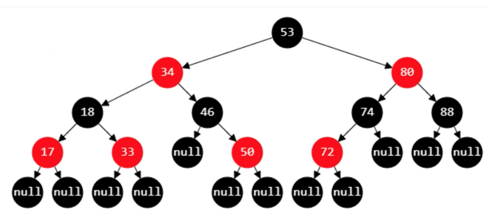
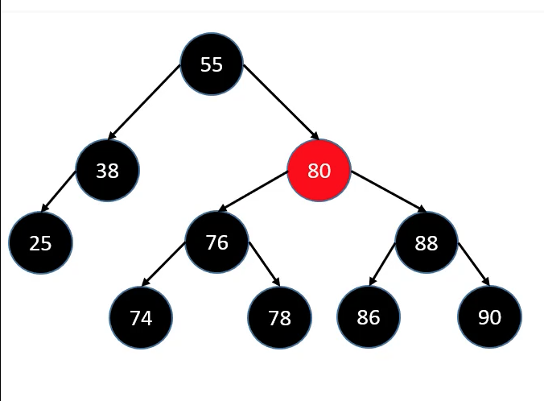
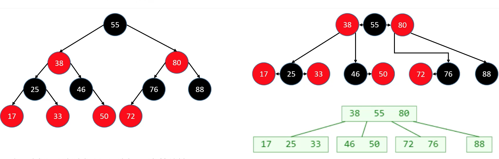
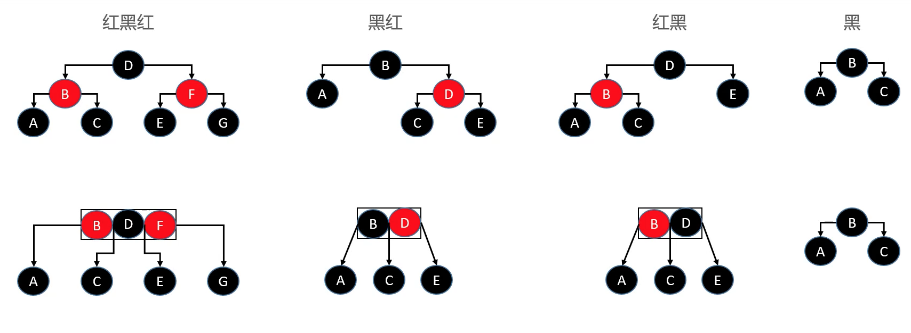

## 一 红黑树

红黑树（Red Black Tree）是一种自平衡的二叉搜索树，以前也称为平衡二叉 B 树（Symmetric Binary B-tree）。

如图所示：  

红黑树除了符合二叉搜索树的基本规则外，还添加如下特性：

-   1.结点是红色/黑色
-   2.根结点是黑色
-   3.叶结点都是黑色空结点（叶结点是假想出来的结点）
-   4.红色结点的子结点都是黑色，也意味着从叶结点到根结点的所有路径上不会有两个连续的红色结点
-   5.从任一结点开始，到达每个叶结点的路径中，都具有相同数量的黑色结点

下图就不是一棵红黑树，因为 55-38-25 路过了 3 个黑色结点，但是 55-38->38 的 right 结点是 2 个黑色结点，不满足第 5 个性质。  

红黑树与四阶 B 树（2-3-4 树）具有等价性质，如下所示红黑树可以“变形”为类似四阶 B 树的样子：  

在该图中，红黑树通过以下操作，实现了到四阶 B 树的转换：

-   黑色结点与其红色子结点融合在一起
-   所以红黑树的黑色结点的个数与 4 阶 B 树的结点总个数相同

具体的红黑树与四阶 B 树的转换如下所示：  

红黑树依据上述的规则，达到了平衡：**从根结点到叶结点的最长路径，不会超过最短可能路径的两倍长！！**，虽然红黑树没有做到绝对平衡，但可以保证在最坏的情况下，仍然是高效的：

-   性质 4 决定了路径不能有两个相连的红色结点
-   最短可能路径都是黑色结点
-   最长可能路径是红色、黑色交替存在
-   性质 5 所有路径都有相同数目的黑色结点

## 二 红黑树常见操作

### 2.0 插入与删除的说明

红黑树不强调 AVL 树的平衡因子概念，插入和删除需要考虑的是是否符合红黑树的 5 个性质！

### 2.1 插入结点

插入的结点默认都是红色的，因为如果是黑色的，必然会导致有一条路径上多了黑色结点，违反了性质 5，调整难度较大！如果是红色则有可能直接就满足上述 5 个规则了，即使出现了红红相连的情况，也可以通过颜色调换来进行调整。

**=======TODO=======**
