## 一 问题思考

学生成绩的集合示例：

```
if socore < 60 {
    level = "不及格"
}
if socore < 70 {
    level = "及格"
}
if socore < 80 {
    level = "中等"
}
if socore < 90 {
    level = "良好"
}
if socore >= 90 {
    level = "优秀"
}
```

这样对成绩的水平线判断必须从 60 开始，然后逐级判断，如图所示：

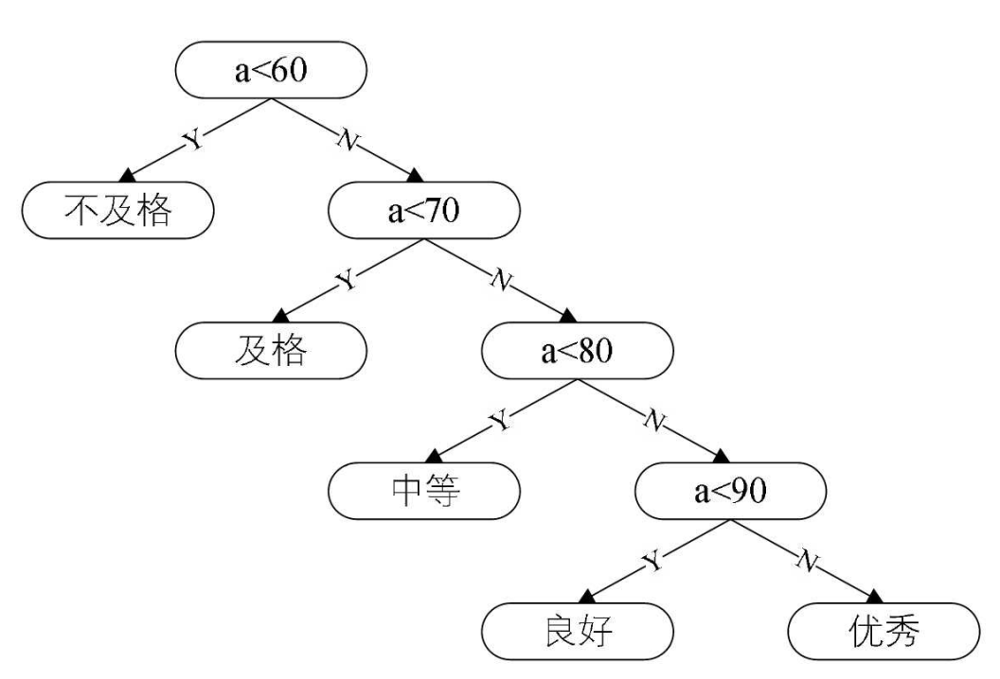

这是有效率问题的，而且学生的成绩大多处于中等、良好范围，不及格与优秀都是少数，如果从 80 分开始判断就会优化很多：

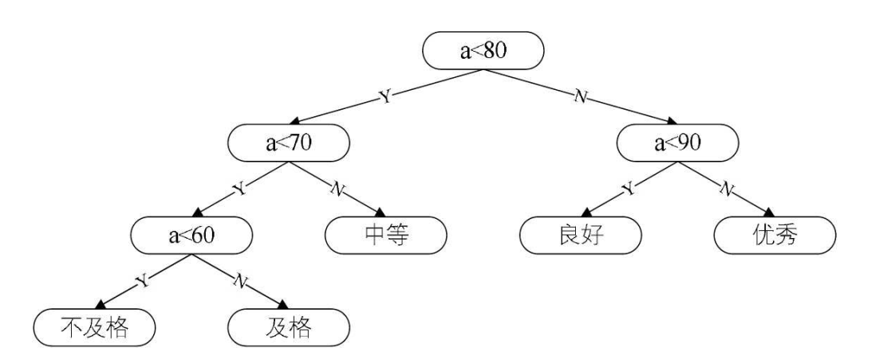

我们先把这两棵二叉树简化成叶子结点带权的二叉树（注： 树结点间的边相关的数叫做权 Weight） ，其中 A 表示不及格、 B
表示及格、 C 表示中等、 D 表示良好、 E 表示优秀。 每个叶子的分支线上的数字就是预设的各类成绩所占百分比。

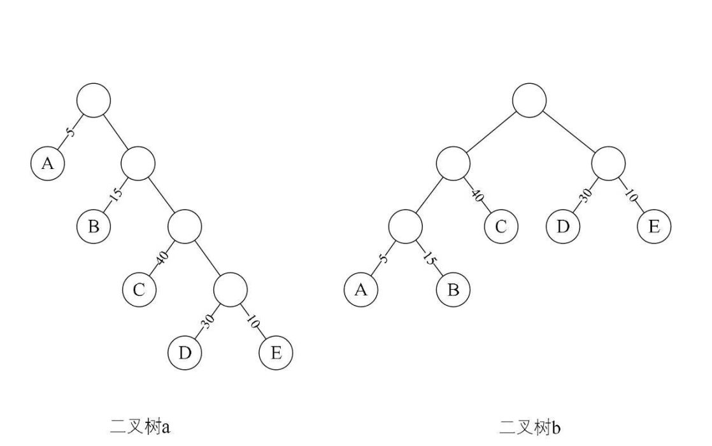

从树中一个结点到另一个结点之间的分支构成两个结点之间的路径， 路径上的分支数目称做路径长度。

二叉树 a 中， 根结点到结点 D 的路径长度就为 4， 二叉树 b 中根结点到结点 D 的路径长度为 2。 树的路径长度就是从树根到每一结点的路径长度之和：

-   二叉树 a 的树路径长度就为 1+1+2+2+3+3+4+4=20。
-   二叉树 b 的树路径长度就为 1+2+3+3+2+1+2+2=16。

## 二 赫夫曼树概述

如果考虑到带权的结点， 结点的带权的路径长度为从该结点到树根之间的路径长度与结点上权的乘积。树的带权路径长度为树中所有叶子结点
的带权路径长度之和。 假设有 n 个权值{w1,w2,...,wn}， 构造一棵有 n 个叶子结点的二叉树， 每个叶子结点带权 wk， 每个叶子的路径长度为 lk， 我
们通常记作， 则其中带权路径长度 WPL 最小的二叉树称做赫夫曼树，也称为最优二叉树。

赫夫曼树的日常应用：文件的压缩。

实例中的 WPL：

```
# 这里5是A结点的权， 1是A结点的路径长度， 其他同理
二叉树a的WPL=5×1+15×2+40×3+30×4+10×4=315
二叉树b的WPL=5×3+15×3+40×2+30×2+10×2=220
```

这意味着：如果我们现在有 10000 个学生的百分制成绩需要计算五级分制成绩， 用二叉树 a 的判断方法， 需要做 31500 次比较， 而二叉树 b 的判断方法， 只需要 22000 次比较， 差不多少了三分之一量， 在性能上提高不是一点点。

## 三 构造赫夫曼树

### 3.1 步骤一

先把有权值的叶子结点按照从小到大的顺序排列成一个有序序列，即： A5， E10， B15， D30， C40。

### 3.2 步骤二

取头两个最小权值的结点作为一个新结点 N<sub>1</sub>的两个子结点， 注意相对较小的是左孩子， 这里就是 A 为 N<sub>1</sub>的左孩子， E 为 N1 的右孩子， 新结点的权值为两个叶子权值的和 5+10=15。

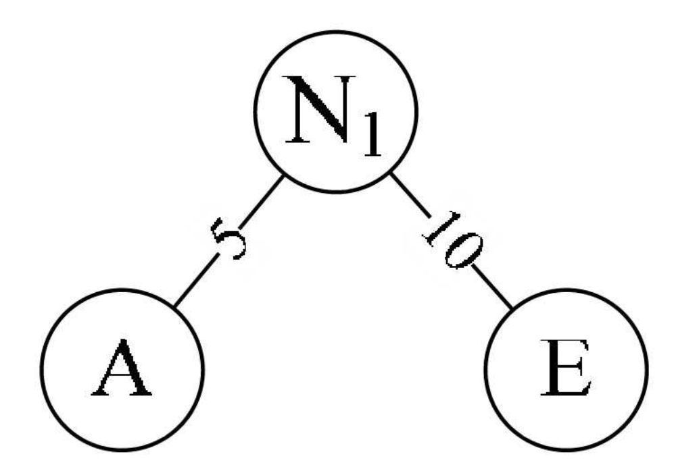

### 3.3 步骤三

将 N<sub>1</sub>替换 A 与 E， 插入有序序列中， 保持从小到大排列。 即：N<sub>1</sub>15， B15， D30， C40。

### 3.4 步骤四

重复步骤 2， 将 N<sub>1</sub>与 B 作为一个新结点 N<sub>2</sub>的两个子结点。 如图所示。 N<sub>2</sub>的权值=15+15=30。

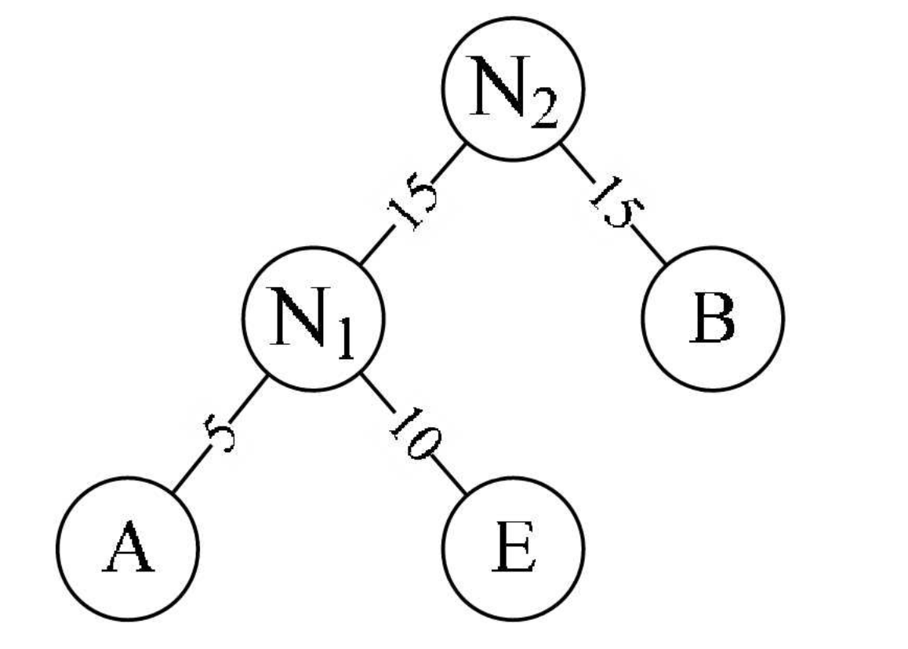

### 3.5 步骤五

将 N<sub>2</sub>替换 N<sub>1</sub>与 B， 插入有序序列中， 保持从小到大排列。 即：N<sub>2</sub>30， D30， C40。

### 3.6 步骤六

重复步骤 2， 将 N<sub>2</sub>与 D 作为一个新结点 N<sub>3</sub>的两个子结点。 如图 6-12-7 所示。 N<sub>3</sub>的权值=30+30=60。

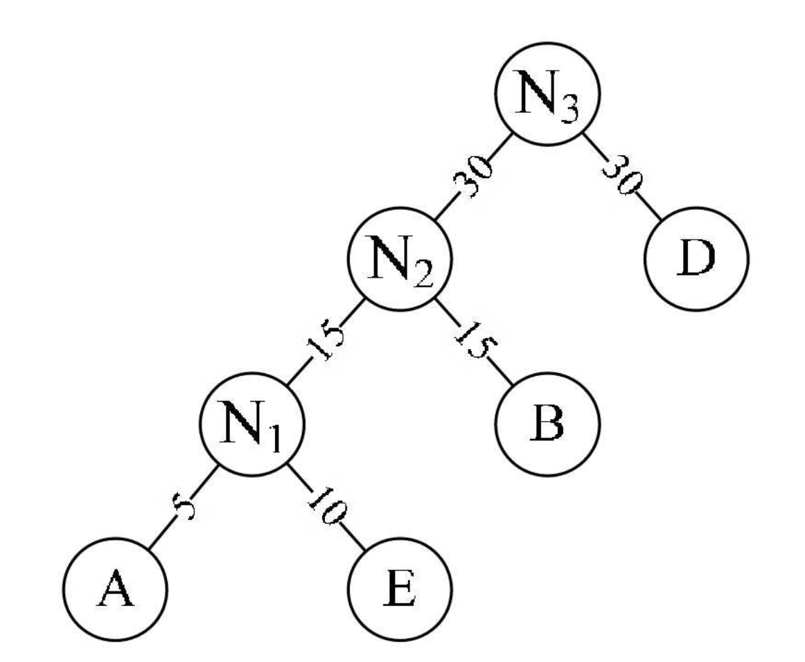

### 3.7 步骤七

将 N<sub>3</sub>替换 N<sub>2</sub>与 D， 插入有序序列中， 保持从小到大排列。 即：C40， N360。

### 3.8 步骤八

重复步骤 2。 将 C 与 N<sub>3</sub>作为一个新结点 T 的两个子结点， 如图所示。 由于 T 即是根结点， 完成赫夫曼树的构造：

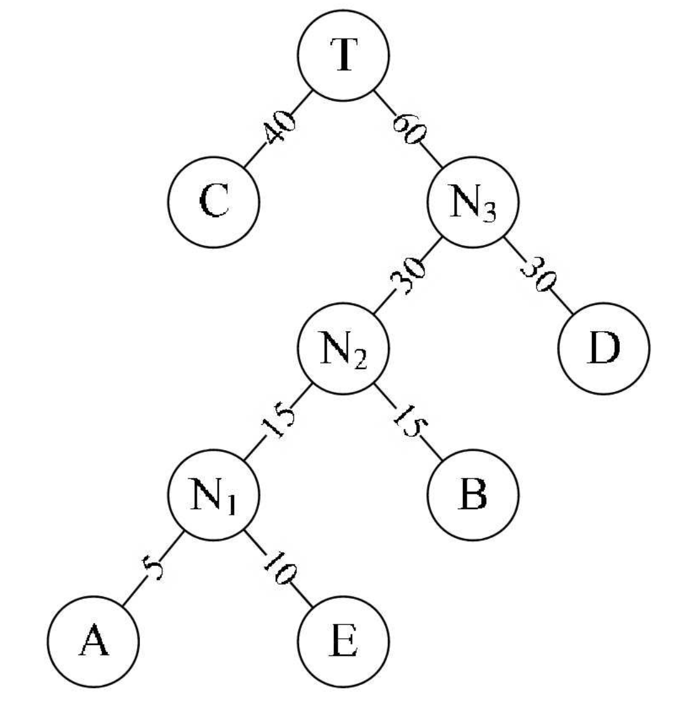

此时二叉树的带权路径长度:

```
WPL=40×1+30×2+15×3+10×4+5×4=205。
```

与之前的二叉树 b 的 WPL 值 220 相比， 还少了 15。 显然此时构造出来的二叉树才是最优的赫夫曼树。

不过由于每次判断都要两次比较（如根结点就是 a<80&&a>=70， 两次比较才能得到 y 或 n 的结果） ， 所以总体性能上反而更低了，不过这也不是讨论的终点。

## 四 赫夫曼算法描述

-   1.根据给定的 n 个权值{w1,w2,...,wn}构成 n 棵二叉树的集合 F={T1,T2,...,Tn}， 其中每棵二叉树 Ti 中只有一个带权为 wi 根结点， 其左右子树均为空。
-   2.在 F 中选取两棵根结点的权值最小的树作为左右子树构造一棵新的二叉树， 且置新的二叉树的根结点的权值为其左右子树上根结点的权值之和。
-   3.在 F 中删除这两棵树， 同时将新得到的二叉树加入 F 中。
-   4.重复 2 和 3 步骤， 直到 F 只含一棵树为止。 这棵树便是赫夫曼树。

## 五 赫夫曼编码

### 5.1 编码

赫夫曼算法诞生的背景是为了解决当年远距离通信（主要是电报） 的数据传输的最优化问题。比如我们有一段文字内容为“BADCADFEED”要网络传输给别人， 显然
用二进制的数字（0 和 1） 来表示是很自然的想法。 我们现在这段文字只有六个字母 ABCDEF， 那么我们可以用相应的二进制数据表示：

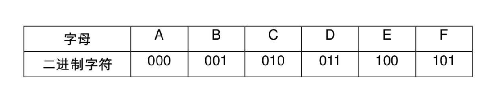

这样真正传输的数据就是编码后的“001000011010000011101100100011”， 对方接收时可以按照 3 位一分来译码。 如果一篇文章很长， 这样的二进制串也将非常的可怕。 而且事实上， 不管是英文、 中文或是其他语言， 字母或汉字的出现频率是不相同的， 比如英语中的几个元音字母“ae i o u”， 中文中的“的 了 有 在”等汉字都是频率极高。

假设六个字母的频率为 A 27， B 8， C 15， D15， E 30， F 5， 合起来正好是 100%。 那就意味着， 我们完全可以重新按照赫夫曼树来规划它们。

左图为构造赫夫曼树的过程的权值显示。 右图为将权值左分支改为 0， 右分支改为 1 后的赫夫曼树：

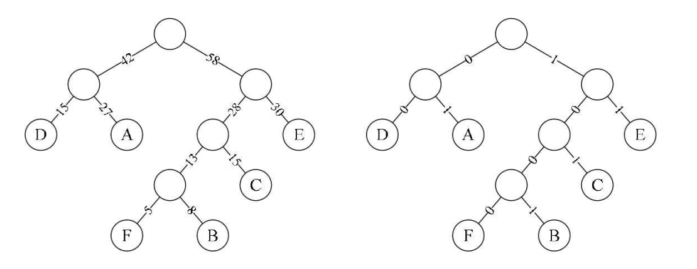

此时， 我们对这六个字母用其从树根到叶子所经过路径的 0 或 1 来编码，得到：

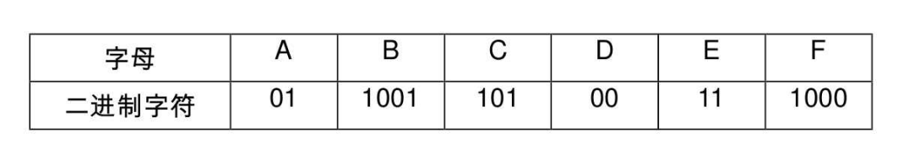

将文字内容为“BADCADFEED”再次编码， 对比可以看到结果串变小了。

-   原编码二进制串： 001000011010000011101100100011（共 30 个字符）
-   新编码二进制串： 1001010010101001000111100（共 25 个字符）

数据被压缩了， 节约了大约 17%的存储或传输成本。随着字符的增加和多字符权重的不同， 这种压缩会更加显出其优势。

### 5.2 解码

编码中非 0 即 1， 长短不等的话其实是很容易混淆的， 所以若要设计长短不等的编码， 则必须是任一字符的编码都不是另一个字符的编码的前缀， 这种编码称做前缀编码。

上述编码后的编码就不存在容易与 1001、 1000 混淆的“10”和“100”编码。如果发送方和接收方必须要约定好同样的赫夫曼编码规则， 当我们接收到 1001010010101001000111100 时， 由约定好的赫夫曼树可知， 1001 得到第一个字母是 B， 接下来 01 意味着第二个字符是 A，其余的也相应的可以得到， 从而成功解码。

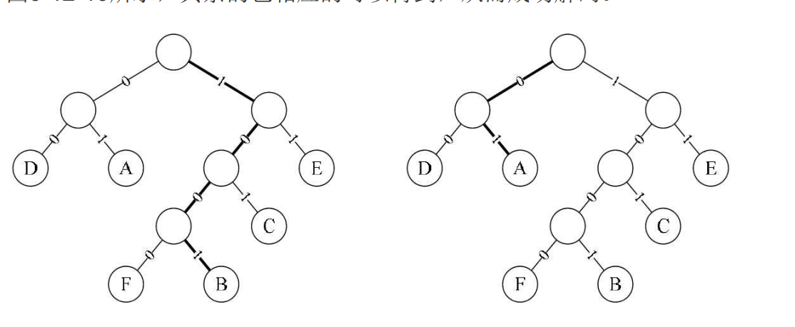

一般地， 设需要编码的字符集为{d1,d2,...,dn}， 各个字符在电文中出现的次数或频率集合为{w1,w2,...,wn}， 以 d1,d2,...,dn 作为叶子结点， 以
w1,w2,...,wn 作为相应叶子结点的权值来构造一棵赫夫曼树。 规定赫夫曼树的左分支代表 0， 右分支代表 1， 则从根结点到叶子结点所经过的路径分支组成的 0 和 1 的序列便为该结点对应字符的编码， 这就是赫夫曼编码。
