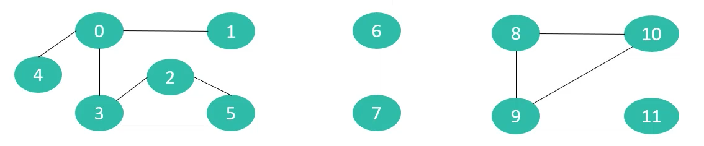
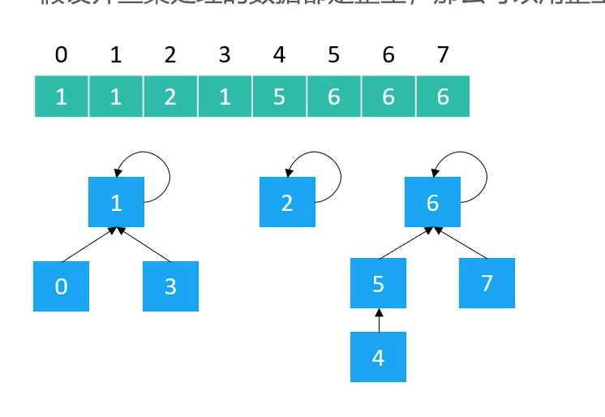
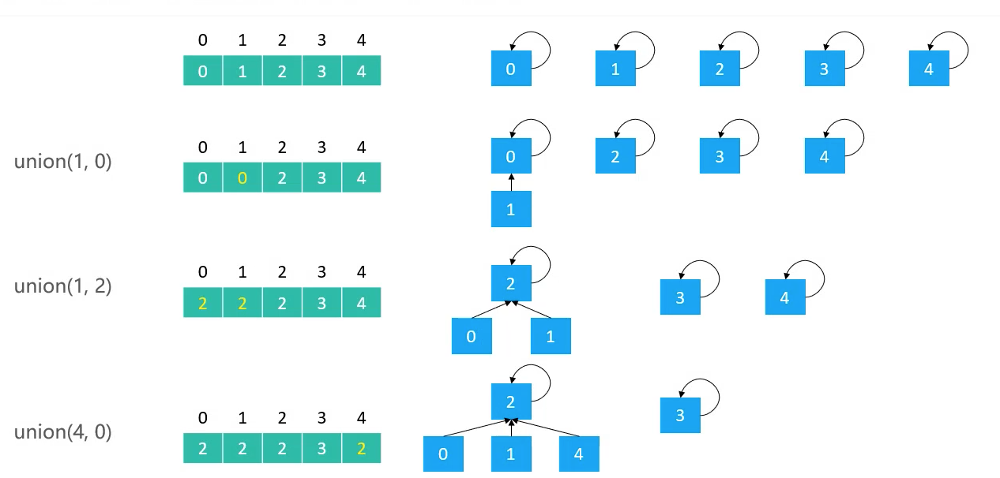
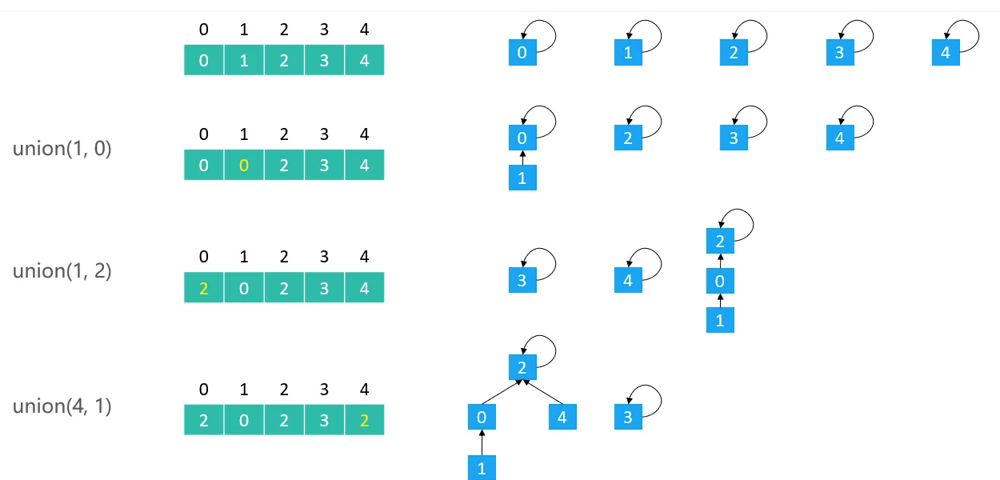
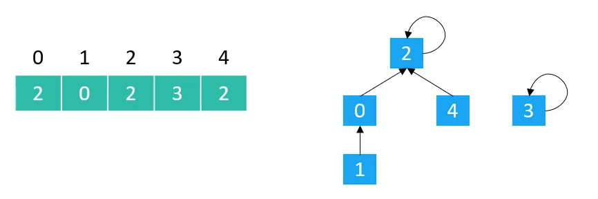

## 一 并查集的引入

假设有 n 个村庄，如下所示，连线代表这些村庄之间有连接的路：



现在设计一个数据结构，满足下列要求：

-   快速查找 2 个村庄之间是否有连接的路，比如 1 和 7
-   连接两个村庄，如 1 和 9，连接后，左侧区域其实都可以到达右侧区域了

上述需求使用大多数数据结构都可以实现，但是他们往往存在时间或者空间上的复杂度问题。

并查集能够做到查询、连接的均摊时间复杂度都是 O(α(n)),α(n)<5。**并查集适合处理“连接”相关问题**，如现实生活中查询某个学生是否属于某 2 个社团，合并两个社团等等。

## 二 并查集概述

> 并查集：Disjoint Set，也称为不相交集合，主要包含 2 个操作：
> 查找：Find，查找元素所在的集合（该集合只是广义的数据集合，并不是数据结构 Set）
> 合并：Union，将两个元素所在的集合合并为一个集合

并查集使用数组存储数据

-   数组索引：表示并查集的具体元素值
-   数组的值：表示元素所在的集合名，集合名正好使用其根元素表示

如下所示三个集合用数组存储后的效果：



并查集与二叉堆、优先级队列一致，都是用数组实现的树形结构。在并查集中，属于同一集合的元素，其根结点都是同一个。

## 三 并查集的实现方式

### 3.0 两种实现方式

并查集有两种实现方式：

-   Quick Find：
    -   查找时间复杂度为 O(1)
    -   合并时间复杂度为 O(n)
-   **Quick Union**：
    -   查找时间复杂度为 O(logn)，但是可以优化到 O(α(n)),α(n)<5
    -   合并时间复杂度为 O(logn)，但是可以优化到 O(α(n)),α(n)<5

开发中推荐使用 Quick Union。

### 3.1 QuickFind

该实现方式比较简单：

-   初始化：分配一个底层数组，每个索引对应的元素的值，也是索引的值，这样就表示了每个索引位置都是一个全新的集合，根结点就是元素的值
-   查找：由初始化得知，所在集合即根结点的值，也即索引对应的元素的值
-   合并：合并的两个参数为元素 v1，v2，现在让 v1 合并到 v2 集合，那么通过查找所在集合函数可以知道 v1 和 v2 所在的根结点，然后遍历数组，数组中所有元素值与 v1 的根结点相同的，都设置为 v2 的根结点即可

如图所示：



查找代码：

```go
func find(v int) int {
    if v < 0 || v >= len(parents)  {
        fmt.Println("容量为空")
    }
    return parents[v]
}
```

合并代码：复杂度必定是 O(n)

```go
func union(v1, v2 int) {
    p1 := find(v1)
    p2 := find(v2)
    if p1 == p2 {
        return
    }
    for i := 0; i < len(parents)l i++ {
        if parents[i] == p1 {
            parents[i] = p2
        }
    }
}
```

### 3.2 QuickUnion

该实现方式：

-   初始化：分配一个底层数组，每个索引对应的元素的值，也是索引的值，这样就表示了每个索引位置都是一个全新的集合，根结点就是元素的值
-   查找：查找所在集合，即根结点的值，也即索引对应的元素的值
-   合并：合并的两个参数为元素 v1，v2，现在让 v1 合并到 v2 集合。让 v1 的根结点转变为 v2 的根结点，那么通过查找所在集合函数可以知道 v1 和 v2 所在的根结点，无需遍历数组，让 v1 的根结点直接变为 v2 的根结点
    -   与 QuickFind 的不同是，这里操作的都是 v1 和 v2 的根结点

使用 QuickFind 形成的树，高度最高只有 2，而使用 QuickUnion 方式实现的树，其高度有可能会远大于 2。

合并的图示：  


解析：

-   `union(1, 0)`，将元素 1 合并到元素 0 所在的集合，即 1 位置集合的根结点合并到 0 所在集合的根结点上
-   `union(1, 2)`，将元素 1 合并到元素 2 所在的集合，即 1 位置集合的根结点合并到 2 所在集合的根结点上。切记：这里操作的都是集合的根结点。
-   `union(4, 1)`，将元素 4 合并到元素 1 所在的集合，即 4 位置集合的根结点合并到 1 所在集合的根结点上。

查找的图示：  

