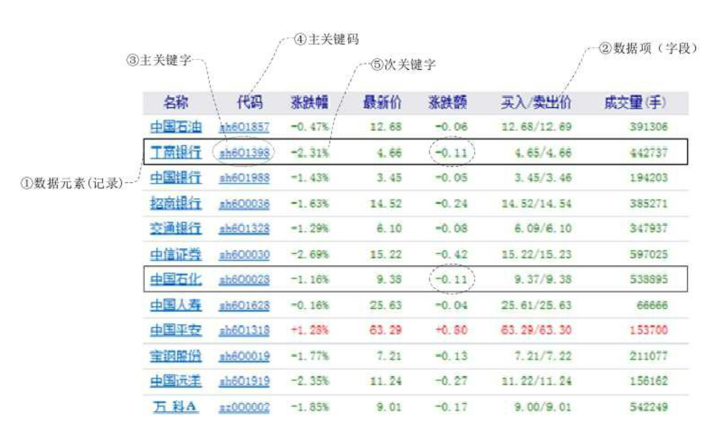

## 一 查找算法概述

需要被查询的数据的集合，被称为查找表（Search Table）。由此得知：查找表是由同一类型的数据元素（或记录）构成的集合。   

关键字（Key） 是数据元素中某个数据项的值， 又称为键值， 用它可以标识一个数据元素。 也可以标识一个记录的某个数据项（字段） ， 我们称为关键码。  

对于那些可以识别多个数据元素（或记录） 的关键字， 我们称为次关键字（SecondaryKey）。  

  

静态查找表（Static Search Table）是只作查找操作的查找表，主要操作有：
- 查询某个“特定的”数据元素是否在查找表中。
- 检索某个“特定的”数据元素和各种属性。

动态查找表（Dynamic Search Table） ： 在查找过程中同时插入查找表中不存在的数据元素， 或者从查找表中删除已经存在的某个数据元素。其操作有：
- 查找时插入数据元素
- 查找时删除数据元素

为了提高查找的效率， 我们需要专门为查找操作设置数据结构， 这种面向查找操作的数据结构称为查找结构。

## 二 顺序表查找

顺序查找（Sequential Search） 又叫线性查找， 是最基本的查找技术，它的查找过程是： 从表中第一个（或最后一个） 记录开始， 逐个进行记录的关键字和给定值比较， 若某个记录的关键字和给定值相等， 则查找成功， 找到所查的记录； 如果直到最后一个（或第一个） 记录， 其关键字和给定值比较都不等时， 则表中没有所查的记录，查找不成功。  

显然顺序表查找的方式是O(n)复杂度的：
```go
func SeqSearch(arr []int, key int) bool{
	for i := 0; i < len(arr); i++ {
		if arr[i] == key {
			return true
		}
	}
	return false
}
```

上述算法其实还有优化空间，每次循环不但要进行key与元素的比较，还要进行 i 与 `len(arr)`的对比，如果数组长度很大，这个消耗也是很可观的，我们可以设置一个“哨兵”，来优化掉这一步：
```go
func SeqSearch(arr []int, key int) bool{

	// 先判断最后一个元素是否与key相等
	maxIndex := len(arr) - 1
	if arr[maxIndex] == key {
		return true
	}

	// 设置最后一个元素为哨兵
	arr[maxIndex] = key

	i := 0
	for ; ; i++ {				// 循环时不再有判断越界的情况
		if arr[i] == key {
			break
		}
	}

	if i == maxIndex {		// 到达了哨兵才退出循环
		return false
	} else {					// 未到达哨兵就退出了循环
		return true
	}
}
```

## 三 查找算法示例

查询15是否在该序列数据中：13,14,26,71,15。  

很多人会想到进行二分查找，但是二分查找还有个前提：数据必须是有序的。所以要先排序，再折半。  

这里可以使用一种特殊的思想：
```go
 arr[13] = true
 arr[14] = true
 arr[26] = true
 arr[71] = true
 arr[15] = true
```

这时，查找的性能直接为O(1)，这便是哈希表的思想。  

## 四 查找算法思想

其实查找算法大多与一些复杂数据结构有关。具体的查找思想可以参照：
- 哈希表
- 二叉搜索树
- 红黑树