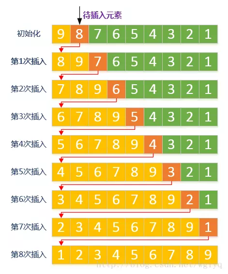

## 零 有序表查找算法概述

如果给出的数据序列是有序的，就不需要再利用上一节提到的顺序查找了，此时查找的方式会变得很多元，且更高效。

## 一 二分查找

二分查找也称为折半查找（Binary Search）。其前提是线性表中的记录必须是有序的。其思想是：在有序表中， 取中间记录作为比较对象， 若给定值与中间记录的关键字相等， 则查找成功； 若给定值小于中间记录的关键字， 则在中间记录的左半区继续查找； 若给定值大于中间记录的关键字， 则在中间记录的右半区继续查找。不断重复上述过程， 直到查找成功， 或所有查找区域无记录， 查找失败为止。  

```go
func BinarySearch(arr []int, key int) bool{

	low := 0				// 定义最低下标为记录首位
	high := len(arr) - 1	// 定义最高下标为记录末位

	if key < arr[low] || key > arr[high] {
		return false
	}

	for low <= high {

		mid := (low + high) / 2
		mid = int(math.Round(float64(mid)))

		guess := arr[mid]
		if guess == key {
			return true
		}
		if guess < key {
			low = mid + 1
		} else  {
			high = mid - 1
		}

	}
	return false
}
```

由于二分查找每次都对数据量进行减半，其时间复杂度为O(logn)

## 二 插值查找

二分查找的思想是对数据进行折半，为什么不能折四分之一或者更多呢？比如从0~10000中查找5，自然会考虑从较小的部分开始查找。

也就是二分查找的折半公式可以进行变更：
```
mid = (low + high)/2 = low + (high - low)/2
```

针对加法后面的二分之一，进行新的改进：  

  

假设 `a[11]={0,1,16,24,35,47,59,62,73,88,99}`， low=1， high=10， 则`a[low]=1`，`a[high]=99`， 如果我们要找的是key=16时， 按原来折半的做法，需要运行4次。但如果用新办法， `(keya[low])/(a[high]-a[low])=(16-1)/(99-1)≈0.153`， 即 `mid≈1+0.153×(10-
1)=2.377` 取整得到 `mid=2 `， 我们只需要二次就查找到结果!!! 

即二分查找的代码更改公式为：
```go
mid = low + (high-low)*(key-a[low])/(arr[high]-arr[low]);
```

这便是有序表插值查找法（Interpolation Search）。根据要查找的关键字key与查找表中最大最小记录的关键字比较后的查找方法， 其核心就在于插值的计算公式(key-a[low])/(a[high]-a[low])。 应该说， 从时间复杂度来看， 它也是O(logn)， 但对于表长较大， 而关键字分布又比较均匀的查找表来说，插值查找算法的平均性能比折半查找要好得多。 反之， 数组中如果分布类似{0,1,2,2000,2001,......,999998,999999}这种极端不均匀的数据， 用插值查找未必是很合适的选择。

## 三 斐波那契查找

波那契查找（Fibonacci Search），是利用黄金分割原理来实现的。

```go

```

