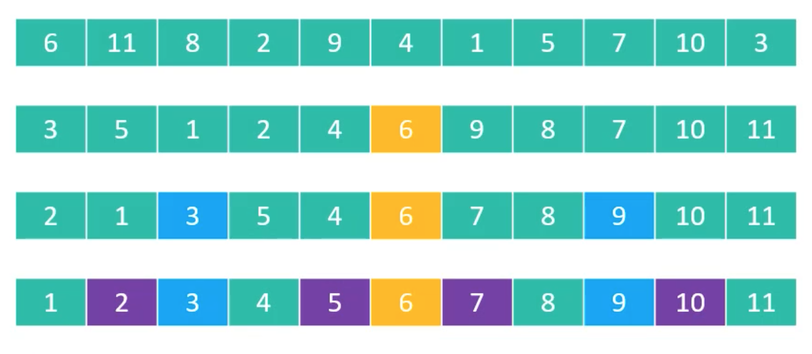

## 零 线性索引查找概述

二分查找等高效查找都是基于有序的基础之上的，但很多数据集可能增长非常快，如新浪微博的回复量每天都是千万条， 要保证记录全部是按照当中的某个关键字有序， 其时间代价是非常高昂的， 所以这种数据通常都是按先后顺序存储。对于这样的数据，快速查找的办法是索引！  

索引是为了加快查找速度而设计的一种数据结构。 索引就是把一个关键字与它对应的记录相关联的过程， 一个索引由若干个索引项构成， 每个索引项至少应包含关键字和其对应的记录在存储器中的位置等信息。 索引技术是组织大型数据库以及磁盘文件的一种重要技术。  

索引按照结构可以分为
- 线性索引
- 树形索引
- 多级索引

线性索引就是将索引项集合组织为线性结构，也称为索引表，有三种常用线性索引：
- 稠密索引
- 分块索引
- 倒排索引

## 一 稠密索引

稠密索引是指在线性索引中， 将数据集中的每个记录对应一个索引项。  

  

稠密索引是针对成千上万的数据来设计的，索引项一定是按照关键码进行的有序排列。  

索引项有序也就意味着， 我们要查找关键字时， 可以用到折半、 插值、斐波那契等有序查找算法， 大大提高了效率。

但是如果数据集非常大， 比如上亿， 那也就意味着索引也得同样的数据集长度规模， 对于内存有限的计算机来说， 可能就需要反复去访问磁盘， 查找性能反而大大下降了。

## 二 分块索引

稠密索引因为索引项与数据集的记录个数相同， 所以空间代价很大。 为了减少索引项的个数， 我们可以对数据集进行分块， 使其分块有序， 然后再对每一块建立一个索引项， 从而减少索引项的个数。例如图书馆的藏书策略。  

分块有序是把数据集的记录分成了若干块，并且这些块需要满足两个条件：
- 块内无序：即每一块内的记录不要求有序。 当然，让块内有序将会更加理想，但这会付出大量时间和空间的代价
- 块间有序：例如， 要求第二块所有记录的关键字均要大于第一块中所有记录的关键字， 第三块的所有记录的关键字均要大于第二块的所有记录关键字……因为只有块间有序， 才有可能在查找时带来效率

对于分块有序的数据集， 将每块对应一个索引项， 这种索引方法叫做分块索引。 

分块索引的索引项结构分三个数据项：
- 最大关键码， 它存储每一块中的最大关键字， 这样的好处就是可以使得在它之后的下一块中的最小关键字也能比这一块最大的关键字要大；
- 存储了块中的记录个数， 以便于循环时使用；
- 用于指向块首数据元素的指针， 便于开始对这一块中记录进行遍历

  

平均查找长度分析：n个记录的数据集被平均分成m块，每个块中有t条记录， 显然 n=m×t， 或者说 m=n/t。 再假设L<sub>b</sub>为查找索引表的平均查找长度， 因最好与最差的等概率原则， 所以L<sub>b</sub>的平均长度为(m+1)/2。 L<sub>w</sub>为块中查找记录的平均查找长度， 同理可知它的平均查找长度为(t+1)/2，那么其平均查找长度为：

   

这个式子的推导是为了让整个分块索引查找长度依赖n和t两个变量。 


平均长度不仅仅取决于数据集的总记录数n， 还和每一个块的记录个数t相关。 最佳的情况就是分的块数m与块中的记录数t相同， 此时意味着n=m×t=t2， 即
    ASL<sub>w</sub>=1/2·(n/t+t)+1=t+1=sqrt(n)+1 

可见， 分块索引的效率比之顺序查找的O(n)是高了不少， 不过显然它与折半查找的O(logn)相比还有不小的差距。 因此在确定所在块的过程中， 由于块间有序， 所以可以应用折半、 插值等手段来提高效率。  

## 三 倒排索引

倒排索引是搜索引擎中常用的算法。  

示例：现在有两篇文章，内容都只是各有下列其中一句话。
```
1.Books and friends should be few but good.（ 读书如交友， 应求少而精。 ）
2.A good book is a good friend.（ 好书如挚友。 ）
```

假设我们忽略掉如“books”、 “friends”中的复数“s”以及如“A”这样的大小写差异。 我们可以整理出这样一张单词表:
```
英文单词 文章编号
a 2
and 1
be 1
book 1,2
but 1
few 1
friend 1,2
good 1,2
is 2
should 1
``` 

此时如果在搜索引擎中查找“book”关键字。系统就先在这张单词表中有序查找“book”， 找到后将它对应的文章编号1和2的文章地址（ 通常在搜索引擎中就是网页
的标题和链接） 返回， 并告诉你， 查找到两条记录， 用时0.0001秒。 由于单词表是有序的， 查找效率很高， 返回的又只是文章的编号， 所以整体速度都非常快。  

如果没有这张单词表，为了能证实所有的文章中有还是没有关键字“book”， 则需要对每一篇文章每一个单词顺序查找。 在文章数是海量的情况下， 这样的做法只存在理论上可行性， 现实中是没有人愿意使用的。  

在这里这张单词表就是索引表，索引项的通用结构是：
- 次关键码， 例如上面的“英文单词”
- 记录号表， 例如上面的“文章编号”

其中记录号表存储具有相同次关键字的所有记录的记录号（可以是指向记录的指针或者是该记录的主关键字） 。 这样的索引方法就是倒排索引（in-verted index） 。  

倒排索引源于实际应用中需要根据属性（或字段、 次关键码） 的值来查找记录。 这种索引表中的每一项都包括一个属性值和具有该属性值的各记录的地址。 由于不是由记录来确定属性值，而是由属性值来确定记录的位置， 因而称为倒排索引。  


倒排索引的优点显然就是查找记录非常快， 基本等于生成索引表后， 查找时都不用去读取记录， 就可以得到结果。 但它的缺点是这个记录号不定长， 比如上例有7个单词的文章编号只有一个，而“book”、 “friend”、 “good”有两个文章编号， 若是对多篇文章所有单词建立倒排索引， 那每个单词都将对应相当多的文章编号， 维护比较困难， 插入和删除操作都需要作相应的处理。  

当然， 现实中的搜索技术非常复杂， 比如我们不仅要知道某篇文章有要搜索的关键字， 还想知道这个关键字在文章中的哪些地方出现， 这就需要我们对记录号表做一些改良。 再比如， 文章编号上亿， 如果都用长数字也没必要， 可以进行压缩， 比如三篇文章的编号是“112,115,119”，我们可以记录成“112,+3,+4”， 即只记录差值， 这样每个关键字就只占用一两个字节。 甚至关键字也可以压缩， 比如前一条记录的关键字是“and”而后一条是“an-droid”， 那么后面这个可以改成“<3,roid>”， 这样也可以起到压缩数据的作用。 再比如搜索时， 尽管告诉你有几千几万条查找到的记录， 但其实真正显示给你看的， 就只是当中的前10或者20
条左右数据， 只有在点击下一页时才会获得后面的部分索引记录， 这也可以大大提高了整体搜索的效率。  
