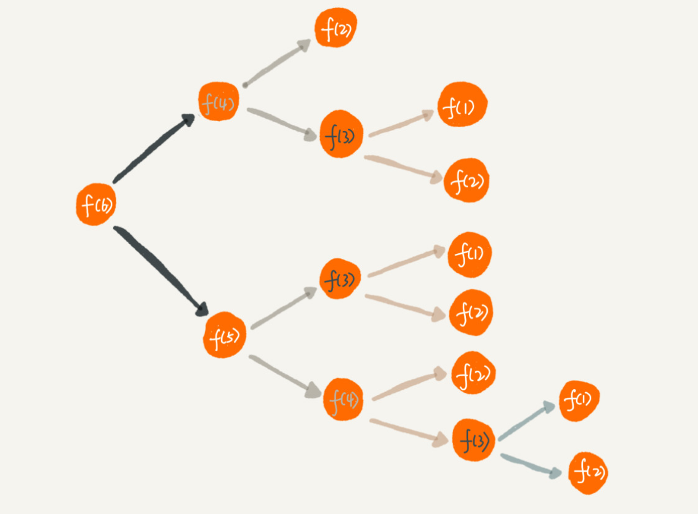
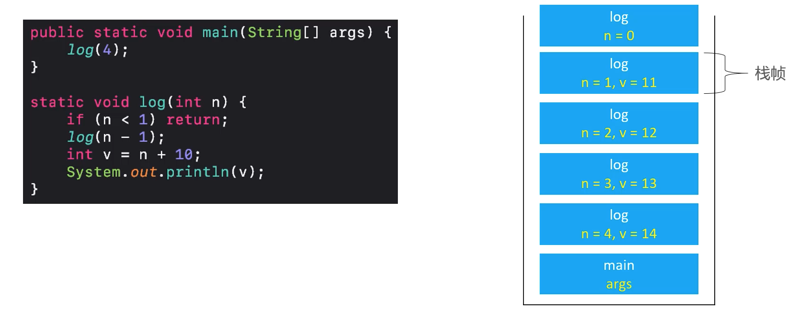

## 一 递归思想

问题引入：用户A推荐了B来注册，B注册后又推荐了C来注册，C注册后推荐了D来注册，这里D的最终推荐人其实是A，如果有这样的场景，给你一个用户，如何查找到其最终推荐人呢？  

递归（Recursion）是对问题规模的分解，去过程称为“递”，回来的过程称为“归”，比如常见的一道数学函数：
```
f(n) = f(n - 1) + 1，f(1) = 1
```

如果用编程的递归实现实现：
```go
func f(n int) int{
    if n == 1 {
        return 1
    }
    return f(n - 1) + 1
}
```

递归是很多算法思想的基础！

## 二 递归的使用

### 1.1 什么样的问题可以使用递归思想

- 一个问题的解可以分解为几个子问题的解：比如查找D的最终推荐人，则可以变为查找C的推荐人，问题接着转变为查找B的推荐人，依次类推
- 这个问题与分解之后的子问题，除了数据规模不同，求解思路完全一样：比如上述问题每个子问题的求解方式是一样的
- 存在递归的终止条件，递归最大的问题就是栈容易溢出，所以必须存在终止条件

### 1.2 如何书写递归函数

写递归代码的关键就是找到如何将大问题分解为小问题的规律，并且基于此写出递推公式，然后再推敲终止条件，最后将递推公式和终止条件翻译成代码。

### 1.3 递归的重复计算

比如有这样一个递归公式：
```
f(1) = 1;
f(2) = 2;
f(n) = f(n - 1) + f(n - 2);
```

转变为递归代码后：
```go
func f(n int) int{
    if n == 1 {
        return 1
    }
    if n == 2 {
        return 2
    }
    return f(n - 1) + f(n - 2)
}
```

其执行过程如图：  


从图中，我们可以直观地看到，想要计算 f(5)，需要先计算 f(4) 和 f(3)，而计算 f(4) 还需要计算 f(3)，因此，f(3) 就被计算了很多次，这就是重复计算问题。  

为了避免重复计算，我们可以通过一个数据结构（比如散列表）来保存已经求解过的 f(k)。当递归调用到 f(k) 时，先看下是否已经求解过了。如果是，则直接从散列表中取值返回，不需要重复计算。

### 1.4 递归并不是最优解

由于递归会占据大量的函数调用栈，会占据大量的内存。递归并不是最优解，只是将复杂的问题简单化！

### 1.5 递归空间复杂度求解

`递归调用的空间复杂度 = 递归深度 * 每次递归需要的辅助空间`

## 二 递归斐波那契

### 2.1 基础的斐波那契递归

公式：
```
f(1) = 1
f(2) = 2
f(n) = f(n) + f(n-2) (n>=3)
```

```go
func Fib(n int) int{
    if n < 1 {
        fmt.Println("参数不合法")
        return 0
    }
    if n <= 2 {
        return 1
    }
    return Fib(n - 1) + Fib(n - 2)
}
```
- 时间复杂度为：`T(n) = T(n - 1) + T(n - 2) + O(1)`，即O(2$^n$)。
- 空间复杂度：O(n)  

### 2.2 优化1 避免重复调用

```go
func Fib(n int) int{
    if n < 1 {
        fmt.Println("参数不合法")
        return 0
    }
    if n <= 2 {
        return 1
    }

    // 设置一个数组（go中的切片）来保存已经运算过的数据
    arr := make([]int, n + 1)       // 使用n+1是为了方便书写
    arr[1] = 1
    arr[2] = 1
    return fibRC(arr, n)
}
func fibRC(arr []int, n int) int{
    if arr[n] == 0 {         // 没有运算过
        arr[n] = fibRC(arr, n - 1) + fibRC(arr, n - 2) 
    }
    return arr[n]
}
```

- 时间复杂度为：O(n) 
- 空间复杂度：O(n)  

### 2.3 优化2 非递归调用

递归并不是最优解，其实可以直接使用最简单的迭代：
```go
func Fib(n int) int {
	if n < 1 {
		fmt.Println("参数不合法")
		return 0
	}
	if n <= 2 {
		return 1
	}
	arr := make([]int, n+1) // 使用n+1是为了方便书写
	arr[1] = 1
	arr[2] = 1
	for i := 3; i <= n; i++ {
		arr[i] = arr[i-1] + arr[i-2]
	}
	return arr[n]
}
```

### 2.3 优化3  滚动数组优化

```go
func Fib(n int) int {
	if n < 1 {
		fmt.Println("参数不合法")
		return 0
	}
	if n <= 2 {
		return 1
	}
	arr := make([]int,2)
	arr[0] = 1
	arr[1] = 1
	for i := 3; i <= n; i++ {
		arr[i % 2] = arr[(i-1) % 2] + arr[(i-2) % 2]
	}
	return arr[n % 2]
}
```

由于 % 运算效率很低， `% 2` 都可以转换为 ` & 1`运算：
```go
func Fib(n int) int {
	if n < 1 {
		fmt.Println("参数不合法")
		return 0
	}
	if n <= 2 {
		return 1
	}
	arr := make([]int,2)
	arr[0] = 1
	arr[1] = 1
	for i := 3; i <= n; i++ {
		arr[i & 1] = arr[(i-1) & 1] + arr[(i-2) & 1]
	}
	return arr[n & 1]
}
```

> 尾调用：Tail Call，一个函数的最后一个动作是调用函数自身
> 尾递归：Tail Recursion，一个函数的最后一个动作是调用自身

尾递归的书写：
```go
func Fib(n int) int {
	if n < 1 {
		fmt.Println("参数不合法")
		return 0
	}
	if n <= 2 {
		return n
	}
	first := 1
	second := 1
	for i := 3; i <= n; i++ {
		second = first + second
		first = second - first
	}
	return second
}
```

### 2.4 其他思路

斐波那契有自己的线性代数特征方程，可以使用Math包下的pow函数求解。 

## 三 递归转非递归的经验

递归是100%可以转换为非递归的，而且可以极大优化递归的性能。  

对于下列递归，如果要将其转换为非递归形式，该如何做？
```go
func log(n int) {
	if n < 1 {
		return
	}
	log(n - 1)
	v := n + 10					// 模拟业务逻辑
	fmt.Println(v)				// 模拟业务逻辑
}
```

其在内存中的实现过程如图：  

  

非递归实现：
```go
func log(n int) {
	for i := 1; i <= n; i++ {
		v := n + 10					// 模拟业务逻辑
		fmt.Println(v)				// 模拟业务逻辑
	}
}
```

所以递归转非递归的方法：
- 方式一：自己维护一个栈，存储递归时的数据，但是这样并未解决递归的本质问题（栈容易溢出），不推荐该方式
- 方式二：如果能重复利用，则可以使用变量保存这些值，如上述代码示例