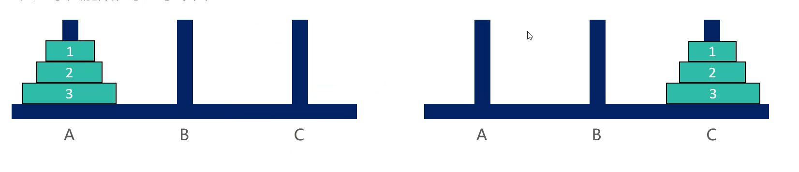

## 三 递归经典题目

### 3.1 上台阶

题目：楼梯有n个台阶，上楼可以一步上1阶，也可以一步上2阶段，走完n阶台阶，则会有多少种走法。  

先找公式：假设n阶台阶有f(n)中走法，从第1步开始走
- 如果上1阶段，则剩下n-1阶段，共f(n-1)种走法
- 如果上2阶段，则剩下n-1阶段，共f(n-2)种走法
- 得出：f(n) = f(n - 1) + f(n - 2)

代码：
```go
func fn(n int) int{
	if n < 1 {
		fmt.Println("参数不合法")
		return 0
	}
	if n <= 2 {
		return n
	}
	return fn(n - 1) + fn(n - 2)
}
```
其实这就是1.3中的示例，这里也可以进行斐波那契类似的优化：
```go
func fn(n int) int{
	if n < 1 {
		fmt.Println("参数不合法")
		return 0
	}
	if n <= 2 {
		return n
	}
	first := 1
	second := 2
	for i := 3; i <= n; i++ {
		second = first + second
		first = second - first
	}
	return second
}
```

### 3.2 汉诺塔

将A处的n个盘子移动到C处，要求：
- 每次只能移动1个盘子
- 大盘子只能放在小盘子下面

  

解决思路：
- n=1时，直接将盘子从A移动到C
- n>1时，拆分为3步
  - 将n-1个盘子从A移动到B
  - 将编号为n的盘子从A移动到C
  - 将n-1个盘子从B移动到C

```go
func Hanoi(n int, p1, p2, p3 string) {
	if n < 0 {
		fmt.Println("参数非法")
		return
	}
	if n == 1 {
		move(n, p1, p3)
		return
	}
	Hanoi(n-1, p1, p3, p2)
	move(n, p1, p3)
	Hanoi(n-1, p2, p1, p3)
}

func move(n int, from, to string) {
	fmt.Printf("将 %d 号盘子从 %s 移动到 %s \n", n, from, to)
}

func main() {
	Hanoi(10, "A", "B", "C")
}
```

复杂度：
- 时间复杂度：O(2$^n$)
- 空间复杂度：O(2n)