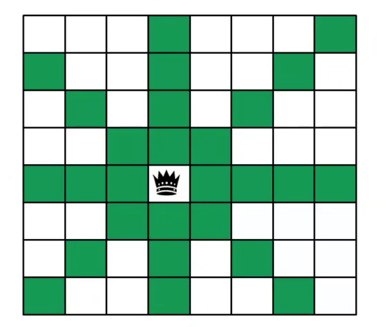
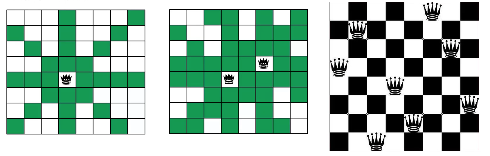
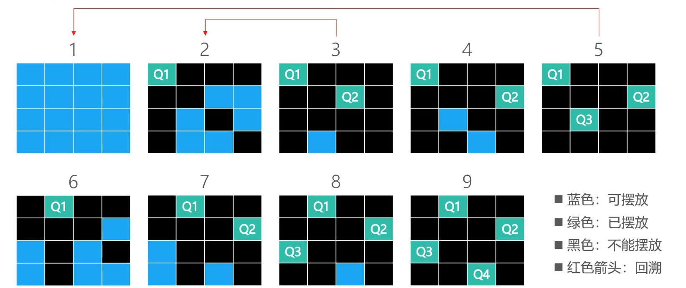

## 一 回溯理论

> 回溯：通过选择不同的岔路扣来通往目的地，每一步都选择一条路触发，能进则进，不能进则退回上一步（回溯），换一条路再试

回溯的经典应用就是：树、图的深度优先搜索（DFS）。使用递归能够很容易实现回溯的思想。  

## 二 回溯与八皇后问题

### 2.0 八皇后问题概述

国际象棋是一个8*8格子的棋盘，皇后棋子能够攻击到其同一列、同一行、同一对角线上的所有其他棋子，如图所示，黑色皇冠部分即为放置了一个皇后，绿色区域都是皇后的攻击范围：  

现在如果要摆放八个皇后，且使其不能相互攻击，会有多少种摆法？这就是著名的八皇后问题(Eight Queens)。  

如下所示，中间图示增加了一个皇后的效果，第三幅图展示了八皇后的一种摆放方式：  

### 2.1 暴力解法

暴力解法也是算法思想的一种，其思路为：从64个格子中选出任意8个格子摆放皇后，检查该摆法的可行性，最终直到找到这样的8个格子。但是这个时间复杂度已经远远超过了想象，大约是4.4 * 10$^9$种。 

不过上述直接暴力法也可以按照实际情况缩小范围：每一行只能放1个皇后，其实只有8$^8$种摆法

### 2.2 回溯法

如果是四皇后，利用下图的回溯过程来演示：  

八皇后也适用于上述回溯规则。当然在实际开发中，一些路径本身就存在着不合理性，比如上图2中，摆放了Q1，那么第二行在做筛选的时候，1号位和2号位都是不可取的，这些地方可以直接忽略，这个过程可以称之为**剪枝**。   

