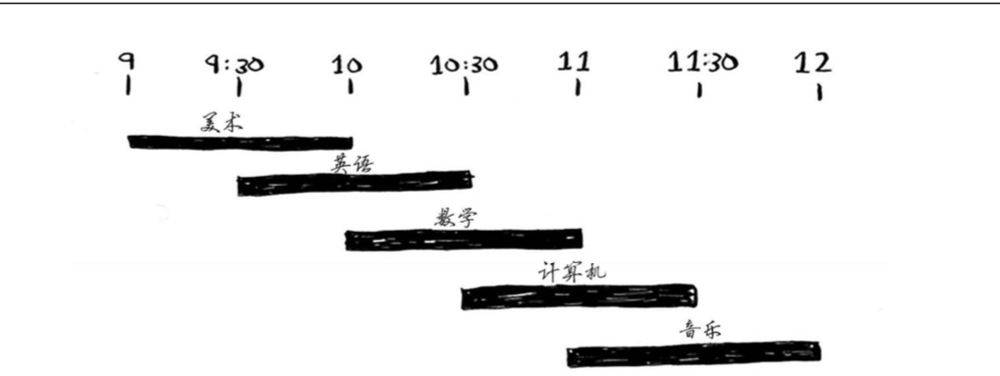

## 一 贪婪算法的引入

#### 1.1 贪婪算法引入

下面是一天内的课程安排表，你可以自主选课，如何才能选择更多的课程去学习？  

  

很显然，会选择：美术、数学、音乐。计算步骤是：
- 1 选出结束最早的课，他是当天第一堂课
- 2 选出第一堂课结束后才开始的课程，且该课程也是结束最早的
- 3 重复上述操作

在上述步骤中，我们每步都使用了最优解，这就是贪心算法（也叫贪婪算法）。在实际生活中，贪心算法也并不是完美的，虽然每步都是最优解，整体下来可能并不能达到最优效果，但是贪心算法简单方便，而且往往最接近最优解，运行时间为O(n<sup>2</sup>)。  

#### 1.2 贪婪算法非最优解

示例二：  

小偷拥有一个4磅重的背包，偷盗策略如下：
- 先装入最贵的商品
- 再装如其次贵的商品

这也是贪心算法，但是有一点难以平衡，假如偷盗了1个4磅最贵的，价值1万美元，此时一个商品已经放满了背包。而放入两件其次贵的，分别是6000美元+5000美元，2件重量也是4磅，那么价值就会达到11000美元。  

显然，在示例二中，贪心算法不是最优解。  

#### 1.3 集合覆盖问题

广播站的基站需要建设在各个地区，有的基站能覆盖多个地区，有的基站能覆盖1-2个地区，现在要覆盖全部的听众，如何选择才能既覆盖全部听众，又建设更少的基站呢，一般传统办法如下：
- 找出所有省区基站集合，也称为幂集（power set），可能的子集有2<sup>n</sup>个
- 在这些地区集合中，选出能覆盖全部省区的基站的最小集合

关键问题在于计算出每个可能的基站子集需要很长时间，运行时间为O(2<sup>n</sup>)。基站越多，运算需要的时间越长。  

使用贪心算法解决：
- 选择这样一个基站：能够覆盖最多的省区的，即使其已经覆盖了一些已经已覆盖的地区
- 重复第一步。  

这是一种近似算法（approximation algorithm），其速度很快，结果也很接近最优解。  

#### 1.4 贪心算法实现

```go
package main

import "fmt"

// 切片去重
func RemoveRepeated(arr []string) (newArr []string) {
	newArr = make([]string, 0)
	for i := 0; i < len(arr); i++ {
		repeat := false
		for j := i + 1; j < len(arr); j++ {
			if arr[i] == arr[j] {
				repeat = true
				break
			}
		}
		if !repeat {
			newArr = append(newArr, arr[i])
		}
	}
	return
}

// 取交集的函数
func MixedSlice(s1 []string, s2 []string)(mixedS []string) {

	for i := 0; i < len(s1); i++ {
		for j := 0; j < len(s2); j++ {
			if s1[i] == s2[j] {
				mixedS = append(mixedS, s1[i])
			}
		}
	}

	mixedS = RemoveRepeated(mixedS)

	return
}

// 求差集：父集与子集的差集
func Difference(father []string, son []string) (diffedS []string) {

	// 去重
	newFather := RemoveRepeated(father)
	newSon := RemoveRepeated(son)

	lenFather := len(newFather)
	lenSon := len(newSon)

	if lenFather < lenFather {
		panic("not son of father...")
	} else if lenFather == lenSon {
		return
	} else {

		for i := 0; i < lenFather; i++ {
			if !isInArray(newSon, newFather[i]) {
				diffedS = append(diffedS, newFather[i])
			}
		}

	}

	return
}

func isInArray(s []string, item string) (b bool){
	b = false
	for i := 0; i < len(s); i++ {
		if s[i] == item {
			b = true
			break
		}
	}
	return
}

func main() {

	// 需要要覆盖的地区集合
	neededStates := []string{"bj", "sh", "hz", "gz", "sz"}

	// 所有的基站列表，并附带这些基站的辐射区域
	stations := map[string][]string{
		"one": {"bj", "sh", "hz"},
		"two": {"bj", "sh", "gz"},
		"three": {"gz", "sz"},
		"four": {"gz", "hz"},
	}

	// 最终选择的基站集
	var finalStations []string

	// 存储在运算中已经被覆盖到的地区，必须是set集合，由于golang没有set，这里使用了切片，并且做了去重处理
	var coveredStates []string

	// 算法逻辑代码一：每次循环时查找其是否是最佳基站
	for {

		fmt.Println("循环前stations：", stations)
		fmt.Println("循环前coveredStates：", coveredStates)

		// 当覆盖地区 coverdStates 长度与 neededStates 长度相等（前提是严格去重）
		if len(coveredStates) == len(neededStates) {
			break
		}

		var mixedNum int				// 当前循环中，交集元素个数
		var bestState string			// 最优选择的基站

		for key := range stations {

			// 获取尚未被覆盖到的基站
			noCoveredStates := Difference(neededStates, coveredStates)

			// 未被覆盖的地区集合 与 当前基站（v）覆盖地区 取交集，交集中数据量最多的，就是最优基站
			if mixedNum < len(MixedSlice(noCoveredStates, stations[key])) {
				mixedNum = len(MixedSlice(noCoveredStates, stations[key]))
				bestState = key
			}
		}

		// 算法逻辑代码二：循环结束后计算当前仍然要循环的stations，neededStates
		coveredStates = append(coveredStates, stations[bestState]...)
		coveredStates = RemoveRepeated(coveredStates)
		delete(stations, bestState)		// 删除stations中已经被确认的最优基站

		finalStations = append(finalStations, bestState)

		fmt.Println("循环后：stations：", stations)
		fmt.Println("循环后：coveredStates：", coveredStates)

		fmt.Println("--------------------------------------------")
	}

	fmt.Println("最终被选中的基站列表：", finalStations)
}
```


