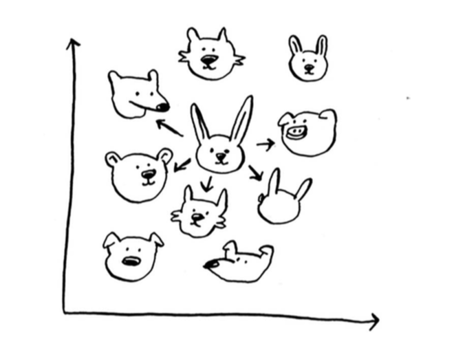

## 一 K最近邻算法的引入  

示例一：现在有个圆形水果，让你辨识是橙子还是橘子，一般情况下，我们会分析橙子和橘子的各个特长，每个特长，这个水果都占据了多少分，最后占据最多分数的类型就是要的结果。  

示例二：现在有一个用户列表，为这些用户进行电影推荐，用户在图表中的位置取决于其喜好，所以喜好相近的用户举例也就较近，如果要想某个用户推荐电影，他最近的几位也可以推荐，只要有这样的图表，推荐系统就很好做了。  

   

