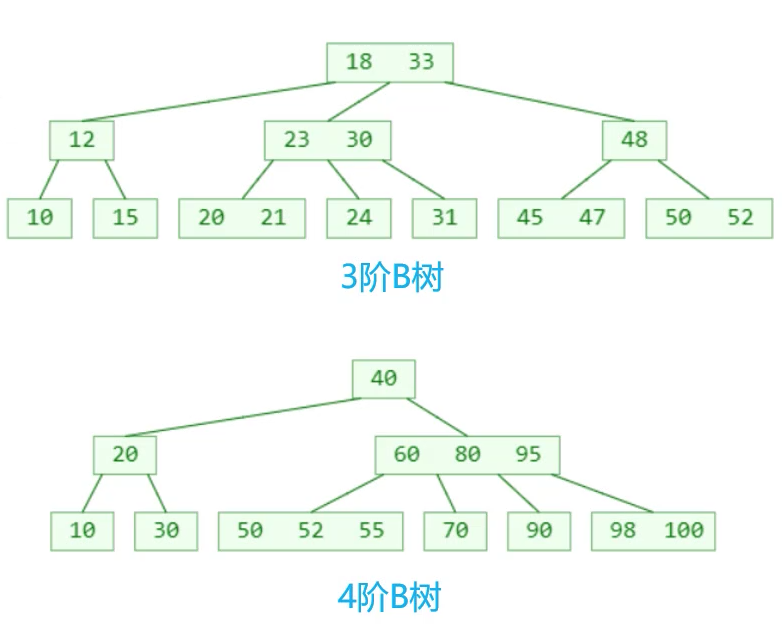
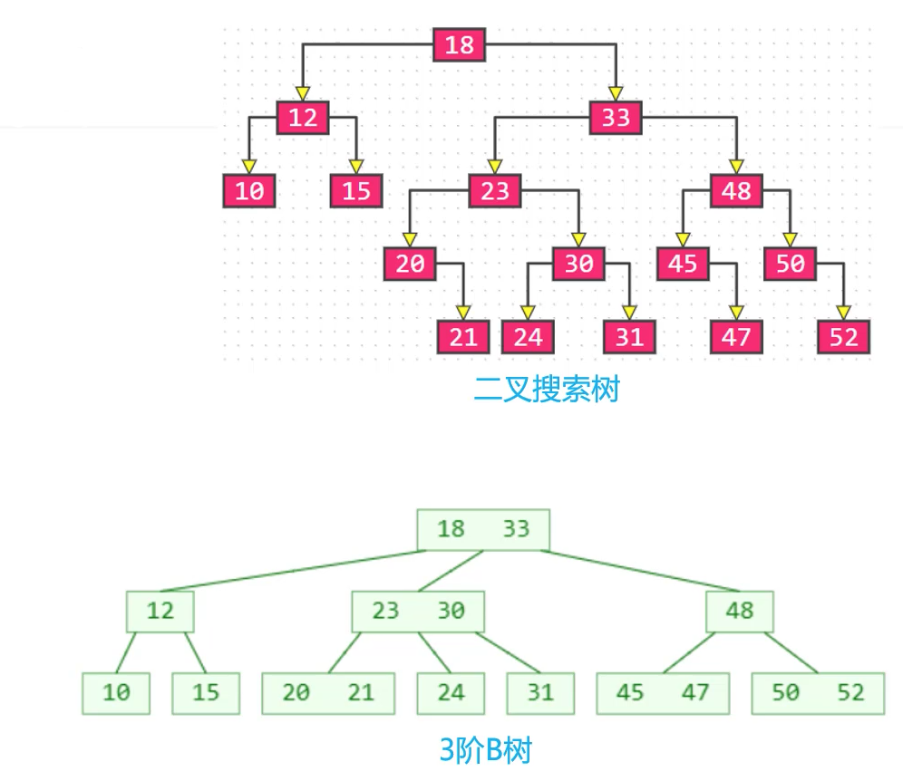
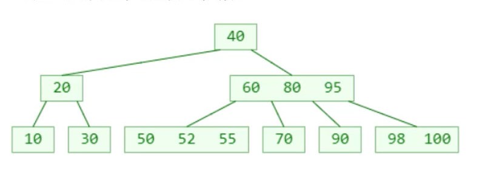
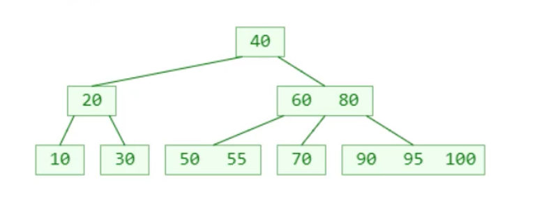

## 一 B树概述

B树（B-tree）是一种平衡的多路搜索树，多用于文件系统、数据库索引实现等。（多路：二叉树只有左右两路，多路自然是有多个子线路）。  

如图所示：  

B树的特点：
- 一个节点可以存储超过2个数据元素，也可以拥有多个子节点
- 具备二叉搜索树的性质
- 平衡性：所有节点的所有子树高度一致
- 树的高度较低

B树拥有 `阶` 的概念，m阶B树（m>=2）的每个节点最多只能拥有m个子节点，每个节点所能存储的数据元素个数也是有限制的，现在我们设一个节点存储的元素个数为x，那么：
- 节点元素个数x的范围：
  - 根节点的x：`1 <= x <= m-1`
  - 非根节点的x：`⌈m/2⌉-1 <= x <= m-1` 
- 节点的子节点个数为 `y = x+1`，且范围为：
  - 根节点：`2 <= y <= m`
  - 非根节点： `⌈m/2⌉ <= y <= m`，
    - 比如 m=3，2<=y<=3，可称为(2,3)树，2-3树
    - 比如 m=4，2<=y<=4，可称为(2,4)树，2-3-4树
    - 比如 m=5，3<=y<=5，可称为(3,5)树

贴士：
- `⌈⌉`是向上取整的符号，`⌊⌋`是向下取整的符号。
- m=2时，其实就是一棵二叉搜索树
- 数据库中一般使用200~300阶

## 二 B-树与二叉搜索树的对应关系

m=2时，B-树其实就是一棵二叉搜索树。而m>2时，B-树也和二叉搜索树有一定的渊源，如图所示： 

  

只要将18与33合并，23与30合并...二叉搜索树的一些多代节点，获得了一些超级节点，最后就会转变为一棵B-树。   

经过n代合并的超级节点，最多拥有2$n$个子节点，至少是2$n$阶B树，相应的，m阶B树，最多需要log$_2$m代合并。  

## 三 B-树的实现思路

### 3.1 搜索实现

- 先从节点内部从小到大搜索元素
- 如果命中，则搜索结束
- 如果未命中，再取对应子节点搜索元素，重复上述步骤  

  
如上图所示，查询数据70，从根节点40开始查找，先查找右侧子节点，在右侧子节点内从左往右：60->80，到大80时发现，70比80小，则从此处的子节点开始查找，就能找到70了。  

### 3.2 添加实现

B树种，新添加的数据必定是添加到叶子节点上。但是此时会引发一个问题，如下所示的一个四阶B树，插入元素98：  

  

此时插入数据98就会引起B树右下角的节点元素个数超过限制，为了维持B树的特性，该现象称为**上溢（overflow）**，此时的解决方案：
- 假设上溢节点的最中间元素位置为k，则将k位置元素向上与父节点合并
- 将叶节点的[0,k-1]和[k+1,m-1]位置的元素分裂成2个子节点
- 如果父节点发生上溢，则对父节点重复上述操作

### 3.3 删除实现

- 删除叶子节点内元素：直接删除即可
- 删除非叶节点内元素：找到前驱/后继元素，覆盖需要删除的元素的值
  - 非叶节点的前驱/后继元素，必定在叶节点中
  - 所以**真正的删除元素都发生在叶子节点中**

删除元素会出现下溢（underflow）的现象，如下一棵5阶B树，删除元素22，则该叶节点的元素个数低于2，不符合5阶B树最小元素个数的规定（大于等于2）。  

如果发生了下溢，则该叶节点的元素个数必定是`⌈m/2⌉-2`：
- 如果下溢节点临近的兄弟节点，有至少`⌈m/2⌉`个元素，可以向其借一个元素，即会发生旋转操作：
  - 将父节点的元素插入到下溢节点的0号位（最小位）
  - 将兄弟节点出借的元素替换到上一步父节点失去的空位
- 如果下溢节点临近的兄弟节点，只有`⌈m/2⌉-1`个元素，兄弟不能出借，
  - 可以将父节点的对应元素与当前节点、兄弟节点合并
  - 该操作可能导致父节点下溢，需要依照重复上述步骤。
  - 如果上溢到根节点，则B树的高度就会+1，同样的下溢会可能造成B树的高度-1

