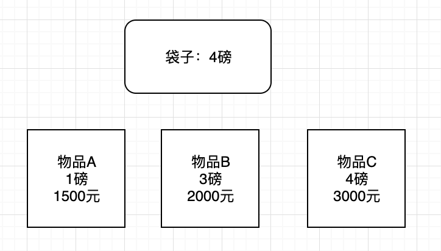
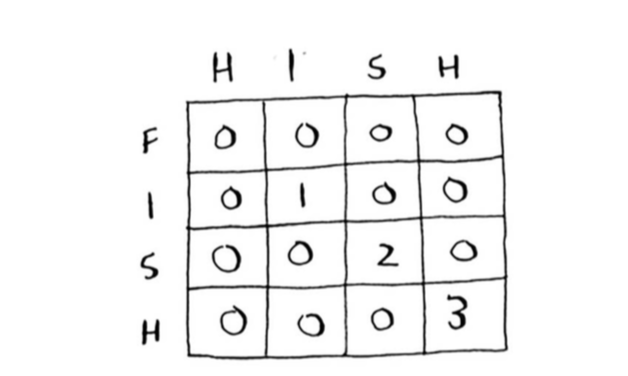
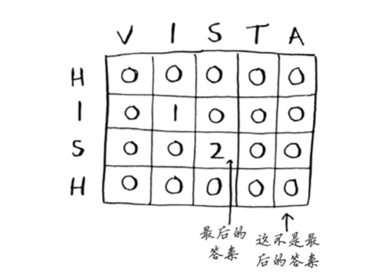
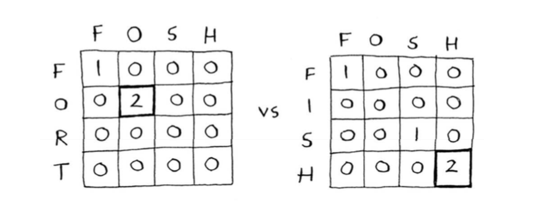
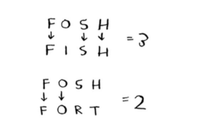
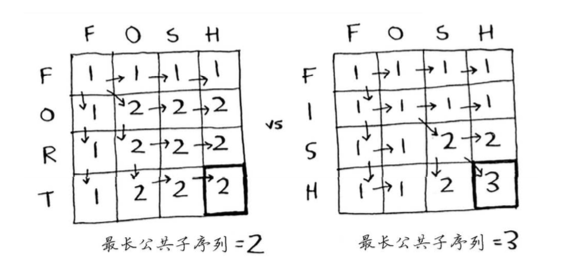
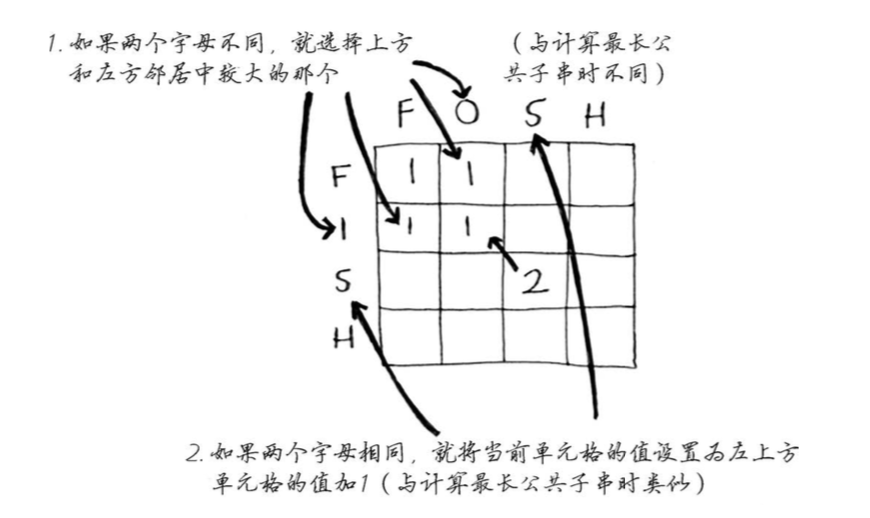

## 一 动态规划的引入

依旧是04章节示例二：  

小偷拥有一个4磅重的背包，偷盗策略如下：
- 先装入最贵的商品
- 再装如其次贵的商品

使用贪心算法，计算的结果只能说比较接近最优结果。比如现在偷盗了4磅最贵的，价值1万美元，此时背包已经满了。而放入两件其次贵的，分别是6000美元+5000美元，2件重量也是4磅，那么价值就会达到11000美元。  

如果我们真的要找到最优解，那么需要将各种物品的重量、价格进行一一组合，假如需要加入组合的元素如下图：  

   

在3件商品下，需要8种组合(23)，即：`[],[A],[B],[C],[AB],[AC],[BC],[ABC]`，有四件物品就有16种组合，这种简单的算法，时间复杂度为O(2n)，效率极低。  

换个思路，先解决小背包问题（子背包问题），背包的承受重量一次从1，2，3，递增到4，然后计算分别计算在这种情况下可选物品的变化：  

   

图中只考虑有物品A时，背包承重增长到4，也只价值1500，再考虑物品B时，背包承重增长到3时，背包最大价值为2000，到达4时，价值可以是3500，然后此时再添加物品C开始计算，依次类推。  

原来的问题是4磅的背包，现在要从1磅，2磅开始考虑，如果我们先解决子问题，再解决大问题，便是动态规划。  

在上述题目中，物品的考虑顺序其实是无关的，无论如何右下角的表格都是最终的答案。  

如果现在新增一个物品D，而这个物品的重量是0.5磅，这样的话，横向的背包就不能从1开始，必须从最小的0.5开始。  

注意：动态规划只考虑要么拿走整个商品，要么考虑不拿，不能只拿走商品本身的一部分。  

动态规划的目的：在给定约束条件下找到最优解。  

## 二 动态规划的实践

常见的实践案例：用户搜索系统中的提示，比如用户想查阅fish，但是输错了，输入了hish，系统将会根据他输入的错误单词进行联想，比如联想出：fish、vista，我们可以利用动态规划求出 fish和hish最长公共子串是 ish。  

如图所示：  

  

对于公共子串问题，答案可能不在右下角的格子中，如下所示：  

 

## 三 最长公共子序列 

如果用户输入了fosh，那么我们预测他输入的是fish还是fort呢？  

现在使用动态规划中最长子串比较如下：  

   

此时他们其实都包含了2个字母，但是确实是fosh和fish更像：  

 

这里比较的是最长公共子序列：两个单词中都有的序列包含的字母书。计算方式如下：  

 

 

 