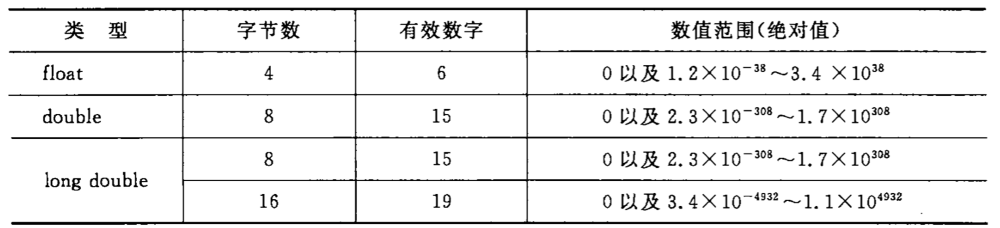

## 一 数据类型概述

在计算机中，数据需要存放在物理存储单元中，所以存储单元必须由有限的字节构成。使用不同范围的存储单元，能够有效的节省空间。  

所谓类型，就是对数据分配存储单元的安排，包括存储单元的长度（多少个字节）以及数据的存储形式，不同的类型分配不同的长度和存储形式。  

C语言运行数据类型（C99）：
- 基本类型
  - 整型
    - 基本整型 int
    - 短整型 short int
    - 长整型 long int
    - 双长整型 long long int
    - 字符型 char
    - 布尔型 bool
  - 浮点型
    - 单精度浮点型 float
    - 双精度浮点型 double
    - 复数浮点型：float_complex, double_comple, long long_comple
- 枚举类型 enum
- 空类型 void
- 派生类型
    - 指针类型 *
    - 数组类型 []
    - 结构体类型 struct
    - 共用体类型 union
    - 函数类型

基本类型和枚举类型都是数值，统称为算术类型（arithmetic type），算术类型和指针类型为纯量类型（scalar type），因为其变量的值是以数字来标识。  

数组类型和结构体类型统称为组合类型（aggregate type），共用体类型不属于组合类型，因为在同一时间内只有一个成员具有值。

## 二 整型数据

#### 2.1 基本整型 int

编译系统分配给int型数据2个字节或4个字节（由具体的C编译系统决定）。存储方式是：用整数的补码（complement）形式存储。  

一个正数的补码是此数的二进制形式，如5的二进制是101，如果使用两个字节存放一个正整数将会如下所示
```
5的二进制： 101

# 两个字节，每个字节8位

# 正整数 5 存储原理
原码：  00000000  00000101            
补码：  00000000  00000101      # 正正数在计算机中真正存储的补码和原码一致

# 负整数 -5 存储原理
原码：  00000000  00000101        
取反：  11111111  11111010      # 按位取反
加一：  11111111  11111011      # 加上 00000000 00000001，生成的值为计算机中存储的负整数 
```  

说明：
- 由上看出，在存放整数的存储单元中，最左边的一位是用来表示符号的，0表示正数，1表示负数  
- 如果给整型分配2个字节，则最大值为 01111111 11111111，即 2<sup>15</sup>-1，即32767
- 依次类推最小值为-2<sup>15</sup>，即-32768
- 如果分配的是4个字节（VC++编译器），则容纳的范围就变成了-2<sup>31</sup>~(2<sup>31</sup> - 1)

#### 2.2 短整型 short int

类型名为`short int`，或者直接写为`short`，VC++编译系统会分配给int数据4个字节，短整型2个字节。其范围是了-2<sup>15</sup>~(2<sup>15</sup> - 1)

#### 2.3 长整型 long int

类型名为`long int`，或者直接写为`long`，其范围是-2<sup>31</sup>~(2<sup>31</sup> - 1)

#### 2.4 双长整型 long long int

C99新增类型，类型名为`long long int`或者`long long`，一般分配8个字节。

#### 2.5 整型变量的符号

在实际开发中，有的数据范围常常只有正值，如学号，年龄，库存等，为了利用该特性，可以将变量定义为无符号类型，即在类型前添加修饰符 `unsigned`。 

对于无符号变量，其补码存储就不必要设定符号位，其字节全部都用于存储实际数据，那么其存储数据的范围也会发生相应变化，如下所示：
```
# 无符号正整数 5 存储原理
有符号最大值：  01111111  11111111            
无符号最大值：  11111111  11111111      # 正正数在计算机中真正存储的补码和原码一致
```

注意：
- 默认数据类型都有前缀 `signed`，只是书写的时候可以省略  
- 只有整型数据有 有符号、无符号修饰符前缀，实型数据不能加
- C语言中输出无符号整数使用 %u（无符号十进制格式输出）
- 无符号整型变量不能接收负值，否则会出现错误

案例演示：
```c
    unsigned short price = -1;
    printf("%d\n", price);      // 输出65535
```

上述案例把-1输出为65535的原因：-1在计算机中先被转换为补码，全部是二进制的1，但是price变量是无符号，第一位不代表符号，输出的结构就是65535。  

#### 2.6 字符型

由于字符是按其代码（整数）形式存储，因此C99将字符型数据作为整数类型的一种，但是字符型数据在使用上也有自己的特点。  

目前大多数系统采用ASCII字符集，包含了127个字符，其存储形式如下案例：
```
大写字母'A'是十进制数65，二进制形式为1000001
小写字母'a'是十进制数97，二进制形式为1100001
...
```

由上看出，127个字符都可以使用7个二进制位表示，所以C语言中字符只占1个字节（8位），字节的第1位为0  

字符可以以十进制整数形式输出，也可以使用字符形式输出：
```c
    char c = 'A';
    printf("%c\n", c);      // A
    printf("%d\n", c);      // 65
```

字符型也可以添加符号前缀：
- signed char：有符号字符型，占据字节数1，取值范围是-128~127（2<sup>7</sup>）
- unsigned char：无符号字符型，占据字节数1，取值范围0~255（2<sup>8</sup）

如果将一个负整数赋值给有符号字符型变量是合法的，但是此时它不代表一个字符，而是作为一个字节整型变量存储负整数，如：
```c
signed char c = -6;
```

注意：如果在定义变量时既不加signed，也不加unsigned，C标准未规定是否按照`signed char`处理，由各个编译器自己决定。

## 三 浮点型

#### 3.1 浮点型概述

浮点数据用来表示带小数点的实数。在C语言中，实数是以指数形式存放在存储单元中的，此时实数可以有很多种表现形式，比如3.14可以书写为3.14*10<sup>0</sup>,
0.314*10<sup>1</sup>，小数点的位置在数值中左右浮动，所以实数的指数形式称为浮点数。  

当小数点的前数为0，后第1位不为0的表示形式为规范化指数形式，如0.314*10<sup>1</sup>。  

#### 3.2 单精度浮点型 float

编译系统为每一个float型变量分配4个字节，数值以规范化的二进制指数形式存储。其中，小数部分和指数部分分别存放，如图所示：  

  

上图使用十进制表示小数部分，实际上计算机是以二进制存储小数部分，以2的幂次表示指数不能分，具体使用多少位来存储由编译器决定。有的编译系统以24位表示小数部分（包括符号），以8位表示指数部分（包括指数的符号）。  

小数部分占的位越大，精度也越高，一般float能得到6位有效数字，那么其范围就是：-3.4*10<sup>-38</sup>~3.4*10<sup>-38</sup>

#### 3.3 双精度浮点型 double

为了扩大范围，使用8个字节存储一个double型数据，可以得到15位有效数字，其范围是：-1.7*10<sup>-308</sup>~1.7*10<sup>-308</sup>。  

在C语言中进行浮点数运算时，float数据都会自动转换为double型，然后进行运算。  

#### 3.4 长双精度型 long doube

不同编译器对该类型处理不同，VC++6.0对`long double`和`double`一样处理，分配8个字节。

#### 3.5 实型数据总结 



## 四 如何确定常量类型 

常量也需要存储在计算机的存储单元，所以也需要确定分配多少字节，按什么方式存储，如VC++6.0中，整数12会被分配4个字节，以补码形式存储。  

从常量的表示形式可以判断其类型，其中字符常量只要看到单引号、转移字符就能确定。  

数值常量按以下规律确定：  
- 不带小数点的数值是整型常量，但应注意其有效范围，例如在VC++中，凡是在-2147483648~2147483648之间的不带小数点的数都作为int，分配4个字节，在此范围外的整数，而又在long long类型之内，则作为long long处理
- 在一个整数末尾添加大写字母L或者小写字母l表示其为长整型long int，如123L，但是VC++中对int和long都分配4个字节，因此没必要使用long int

浮点型常量：  
凡是以小数、指数形式出现的实数都是浮点常量，内存中以指数形式存储，并且都按照双精度处理，分配8个字节。  