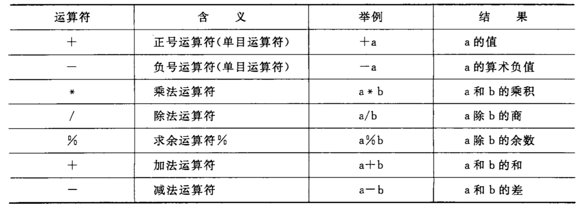

## 一 运算符

#### 1.1 基本的算术运算符  

  

注意：
- 两个实数相除的结果是双精度实数
- 两个整数相除的结果是整数，如5/3结果为1，舍去小数部分
- 如果除数和被除数存在一个负值，舍入方向由编译器决定，在VC++中采取向零取整法(取整后向零靠拢)，`-5/3 = -1`
- %中参与运算的操作数必须为整数，结果也为整数

#### 1.2 自增自减

自增自减的作用是使变量的值+1或者-1：
```
++i,--i：使用i之前，先使i的值改变1
i++,i--：使用i之后，再使i的值改变1
```

#### 1.3 C运算符总结

- 算术运算符    + - * / % ++ --
- 关系运算符    > < == >= <= !=
- 逻辑运算符    ! && ||
- 位运算符      << >> ~| ^ &
- 赋值运算符    =
- 条件运算符    >?:
- 逗号运算符    ,
- 指针运算符    * &
- 求字节数      sizeof
- 强制类型转换  (类型)
- 成员运算符    .->
- 下标运算符    []

贴士：凡是二元运算符，都可以与赋值符一起组合成复合赋值符，有：+=，-=，*-，/=，%=

## 二 表达式

#### 2.1 算术表达式

用算术运算符和括号将运算对象（操作数）连接起来，符合C语言规则的式子称为C算术表达式，如：
```c
a * b /c - 1.5 + 'a'
```

C语言还规定了运算符的结合性，在表示求值时，先按运算符的优先级顺序执行。

#### 2.2 不同类型数据间的混合运算

如果运算符两侧的数据类型不同免责先进行自动类型转换，再运算，因此，整型、实型、字符型数据之间可以进行混合运算，其规律为：
- +，-，*，/ 运算的两个数中有一个为浮点型，则结果是double型
- int与float/double进行运损，先将int和float转换为double，结果是double
- 字符型与整型运算，会按照ASCII表运算，如果与实型数据运算，则转换为doyble后再运算

#### 2.3 强制类型转换

语法：(类型名)(表达式)  

示例：
```c
(double)a       # 将 a 转换为double
(float)(5 % 3)  # 将 5 % 3 转换为float
```

当自动类型转换不能实现目的时，可以使用强制类型转换，如：x为float型，则`x%3`不合法，必须用`(int)x%3`。  


## 三 两个常用输出函数

#### 3.1 printf

注意，helloworld程序中的printf并不是C语言本身的函数，而是C标准库所提供的。  

printf的格式符：  


#### 3.2 scanf


#### 3.3 字符数据的输入输出
```c
putchar(c)          // 输出字符变量c的值
getchar()           // 从终端获取一个字符
```
