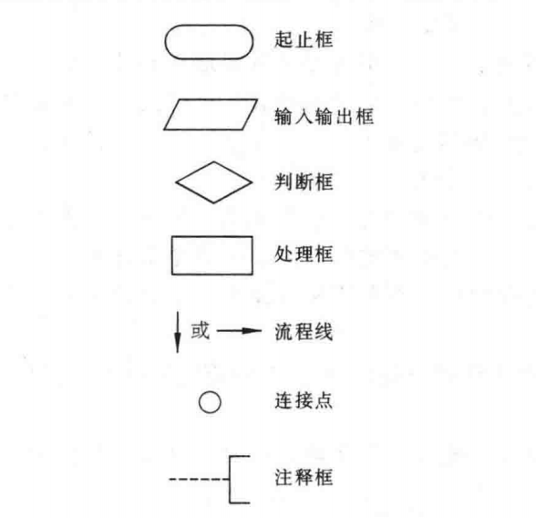
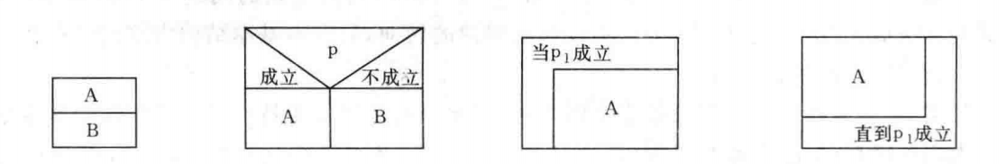
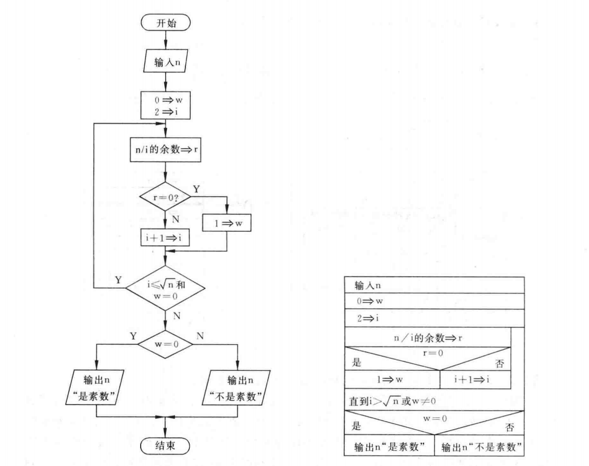

# 00-计算机程序概念

## 一 计算机程序

两个概念：

- **程序**：一组计算机能识别和执行的指令。
- **程序设计**：每一条指令使计算机执行特定的操作，只要让计算机执行这个程序，计算机就会自动执行各条指令。为了使计算机系统能够实现各种功能，需要成千上万的程序，这些程序大多由软件开发人员根据需求设计好的。

一个程序主要包括两方面：

- 对数据的描述，即数据结构（data structure）
- 对操作的描述，即算法（structure）

著名计算机科学家沃思提出了一个公式：

> 算法 + 数据结构 = 程序

## 二 计算机语言

### 2.1 计算机语言常识

计算机工作基于二进制，只能识别由 0 和 1 组成的指令。在早期，计算机指令长度是 16，即 16 个二进制数，如`1011111000000000`。

常用概念：

- **机器指令**（machine instruction）：计算机能直接识别和接受的二进制代码。
- **机器语言**（machine language）：机器指令的集合。
- **符号语言**（symbolic language）：机器语言不符合人类语言习惯，复杂难学，人们用一些符号和数字来表示一个指令，如`ADD`代表加，这样的语言叫做符号语言。
- **汇编程序**：计算机不能识别符号语言，需要汇编程序把这些符号语言指令转换为机器指令。
- **汇编语言/符号汇编语言**（symbolic assember language/assembler language）：一般一条符号语言的指令对应转换为一条机器指令，转换的过程为“代真”/“汇编”，因此符号语言又成为符号汇编语言或者汇编语言。
- **低级语言**（low level language）：不同型号的计算机的机器语言和汇编语言互不通用，因为其完全依赖于具体计算机的特性，由于贴近金酸剂，汇编语言被称为低级语言。
- **高级语言**（high level language）：为了克服低级语言缺点，20 世纪 50 年代，第一个高级语言诞生--Fortran。高级语言功能强大，且不依赖于机器。  
  **源程序**（source c）：使用高级语言书写的程序。

**目标程序**（object c）：编译软件将源程序转换为机器指令后的程序。目标程序可以被计算机执行得到运行结果。

#### 3.2 高级语言的发展历程

**阶段一**：非结构化语言，如 BASIC,FORTRAN 等

- 编程风格随意，没有严格的语言规范要求
- 程序流程可以随意跳转

**阶段二**：结构化语言，如 C 语言

- 程序拥有良好的结构：../循环
- 程序流程不可以随意跳转，程序总是从上往下执行

**阶段三**：面向对象语言，如 Java，VB

- 用来处理大规模软件开发问题

## 四 程序与算法的表示方法

### 4.1 表示法一：自然语言表示法

用人类的语言来表述程序与算法，这显然是有困难的。

### 4.2 表示法二：流程图

美国标准协会 ANSI 规定了一些常用的流程图符号，如下所示：



贴士：连接点（小圆圈）用于连接不同的流程线，无需刻意画出。

### 4.3 表示法三：N-S 流程图

1973 年，美国学者 I.Nassi 和 B.Shneiderman 提出：去掉箭头流程线，算法都卸载矩形框内，且可以形成不同的从属框，这便是 N-S 流程图。



判断一个大于或等于 3 的正整数是否是素数流程图示例：



### 4.4 表示法四：伪代码

伪代码示例：

```txt
begin
    1 => t
    2 => i
    while i <=5 {
        t * i => t
        i + 1 => i
    }
    print t
end
```

### 4.5 表示法五：计算机语言表示

这就是纯粹的使用 C、C++、Java、Go 等语言来实现算法了。

## 五 结构化程序设计方法

1966 年，Bohra 和 Jacopini 提出了三种基本结构，刻意表示出一个良好的算法结构：

- 顺序结构
- 选择结构
- 循环结构：包括当型循环结构（while）、直到型循环结构（until）

一个结构化的程序就是用计算机语言表示的结构化算法，使用了上述 3 种基本结构组成的程序必然是结构化程序，这样的程序便于编写、阅读、维护。
