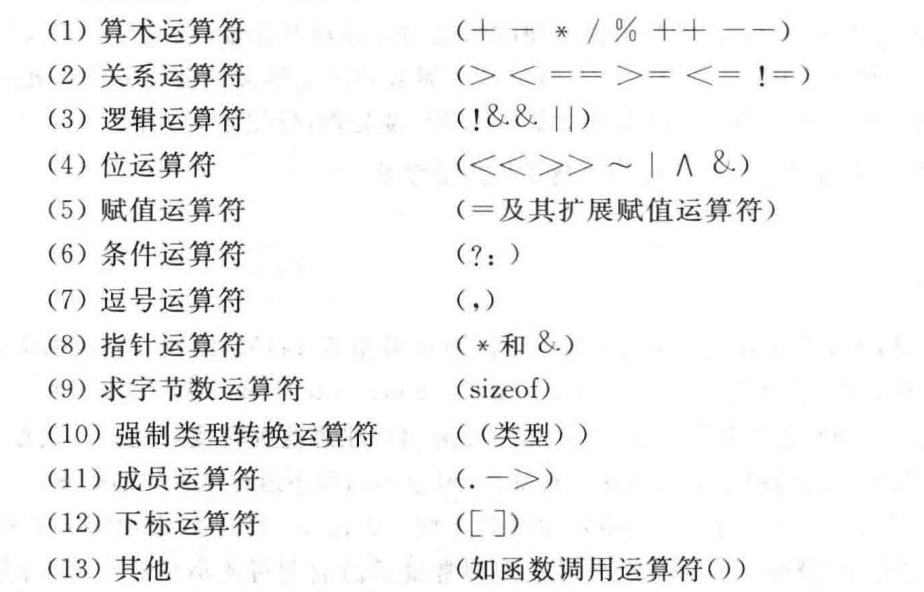

# 04-运算符与表达式

## 一 运算符

C 语言提供的运算符分类：



注意事项：

- 两个实数相除的结果是双精度实数
- 两个整数相除的结果是整数，如 5/3 结果为 1，舍去小数部分
- 如果除数和被除数存在一个负值，舍入方向由编译器决定，在 VC++中采取向零取整法(取整后向零靠拢)，`-5/3 = -1`
- %中参与运算的操作数必须为整数，结果也为整数
- ++i,--i：使用 i 之前，先使 i 的值改变 1
- i++,i--：使用 i 之后，再使 i 的值改变 1

## 二 表达式

### 2.1 算术表达式

用算术运算符和括号将运算对象（操作数）连接起来，符合 C 语言规则的式子称为 C 算术表达式，如：

```c++
a * b /c - 1.5 + 'a'
```

C 语言还规定了运算符的结合性，在表示求值时，先按运算符的优先级顺序执行。

### 2.2 不同类型数据间的混合运算

如果运算符两侧的数据类型不同免责先进行自动类型转换，再运算，因此，整型、实型、字符型数据之间可以进行混合运算，其规律为：

- +，-，\*，/ 运算的两个数中有一个为浮点型，则结果是 double 型
- int 与 float/double 进行运损，先将 int 和 float 转换为 double，结果是 double
- 字符型与整型运算，会按照 ASCII 表运算，如果与实型数据运算，则转换为 doyble 后再运算

### 2.3 强制类型转换

语法：(类型名)(表达式)

示例：

```c++
(double)a       # 将 a 转换为double
(float)(5 % 3)  # 将 5 % 3 转换为float
```

当自动类型转换不能实现目的时，可以使用强制类型转换，如：x 为 float 型，则`x%3`不合法，必须用`(int)x%3`。

## 三 三目运算

```c++
#include <stdio.h>

int main(){
 int a = 10;
 int b = 20;
 int c;

 if (a > b){
  c = a;
 } else {
  c = b;
 }
 printf("c1 = %d\n", c);

 a = 1;
 b = 2;
 c = ( a > b ? a : b );
 printf("c2 = %d\n", c);

 return 0;
}
```

## 四 位运算

按位取反（~）：将每个 1 变为 0，将每个 0 变为 1

```c++
 unsigned char a = 2;   //00000010
 unsigned char b = ~a;  //11111101
```

按位与（&）：只有两个操作数的对应位都是 1 时结果才为 1

```txt
   (10010011)
 & (00111101)
 = (00010001)
```

按位或（|）：如果其中任意操作数中对应的位为 1，那么结果位就为 1

```txt
 (10010011)
  | (00111101)
  = (10111111)
```

按位异或（^）：如果操作数中的对应位有一个是 1(但不是都是 1)，那么结果是 1.如果都是 0 或者都是 1，则结果位 0

```txt
 (10010011)
  ^ (00111101)
  = (10101110)
```

## 五 移位运算符

### 5.1 左移

左移运算符<<将其左侧操作数的值的每位向左移动，移动的位数由其右侧操作数指定。空出来的位用 0 填充，并且丢弃移出左侧操作数末端的位。在下面例子中，每位向左移动两个位置。

```c
(10001010) << 2
(00101000)
```

该操作将产生一个新位置，但是不改变其操作数。

```c++
1 << 1 = 2;
2 << 1 = 4;
4 << 1 = 8;
8 << 2 = 32
```

**左移一位相当于原值\*2!**

### 5.2 右移

右移运算符>>将其左侧的操作数的值每位向右移动，移动的位数由其右侧的操作数指定。丢弃移出左侧操作数有段的位。对于 unsigned 类型，使用 0 填充左端空出的位。对于有符号类型，结果依赖于机器。空出的位可能用 0 填充，或者使用符号(最左端)位的副本填充。

```c++
//有符号值
(10001010) >> 2
(00100010)     //在某些系统上的结果值

(10001010) >> 2
(11100010)     //在另一些系统上的结果

//无符号值
(10001010) >> 2
(00100010)    //所有系统上的结果值
```

### 5.3 用法

移位运算符能够提供快捷、高效（依赖于硬件）对 2 的幂的乘法和除法。

- `number << n`：$number\times2^n$
- `number >> n`：如果 number 非负，则为 $number\div2^n$
