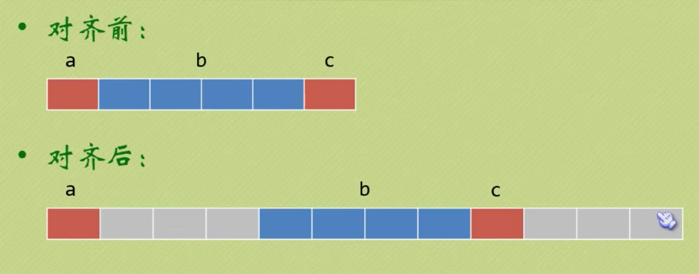
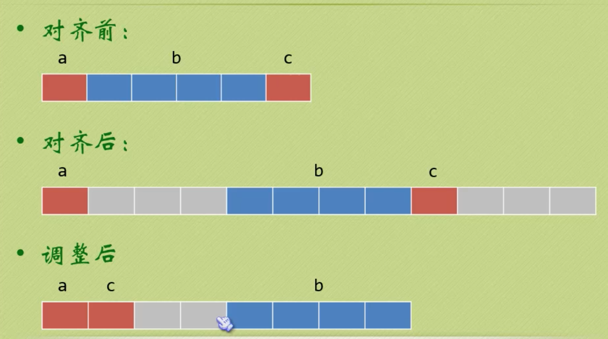

# 12-自定义类型

## 关于自定义类型

常见的自定义类型（即复合类型）有：

- 结构体
- 共用体（联合体）
- 枚举

使用关键字 `typedef` 可以定义一个新名字，但不能创建新类型。

## 一 结构体

### 1.1 结构体的定义

结构体可以用来体现一个自定义的数据类型，有三种定义方式：

```c++
    // 方式一：先声明结构体类型，再创建一个变量
    struct Student1 {
        char *name;
        int age;
    };
    struct Student1 s1 = {"lisi", 18};
    printf("p1.name = %s\n", s1.name);
    struct Student1 *ps1 = &s1;
    printf("ps1->name = %s\n", ps1->name);

    // 方式二：匿名结构体，省略了名字，无法使用该结构体定义新变量
    struct {
        char *name;
        int age;
    }s0,s2;
    s2.name = "lisi";
    s2.age = 30;
    printf("s2.name = %s\n", s2.name);

    // 方式三：在声明类型的同时初始化一个变量，该方式使用较少
    struct Student3 {
        char *name;
        int age;
    }s3 = {"lisi", 18};
    printf("s3.name = %s\n", s3.name);
    struct Student3 *ps3 = &s3;
    printf("ps3->name = %s\n", ps3->name);

    // 方式四：使用 typedef 创建新类型
    typedef struct {
        char *name;
        int age;
    }Student4;
    Student4 s4 = {"lisi", 18};
    printf("s4.name = %s\n", s4.name);
    Student4 *ps4 = &s4;
    printf("ps4->name = %s\n", ps4->name);
```

### 1.2 访问结构体成员

使用 `.` 可以访问到结构体的成员，如 Person 结构体的变量 p，访问其成员 name 的方式为：`p.name`。

当然在创建结构体变量时，也可以使用点语法：

```c++
// 可以只初始化少部分成员
struct Person p = {.name="lisi"};

// 成员的顺序也可以随意
struct Person p2 = {
    .age = 30,
    .name = "lisi"
}
```

### 1.3 结构体的内存对齐

现在有如下结构体：

```c++
    struct A {
        char a;
        int b;
        char c;
    } a = {'x', 520, '1'};
```

现在结构体变量 a 所占据的字节数在 32 位系统并不是 6，而是 12，因为系统会进行内存对齐：



贴士，如果我们现在将结构体中的成员进行修改，那么其所占据的字节数会变成 8：

```c++
    struct A {
        char a;
        char c;
        int b;
    } a = {'x', 520, '1'};
```

因为调整的方式变成了：



### 1.4 结构体传递

结构体之间可以直接进行赋值：

```c++
    struct Demo {
        int x;
        int y;
    } d1, d2;

    d1.x = 3;
    d1.y = 6;

    d2 = d1;
    printf("d2.x=%d, d2.y=%d\n", d2.x, d2.y);
```

利用上述现象，就可以进行结构体传递。不过结构体是值传递的，如下所示：

```c++
#include <stdio.h>
#include <string.h>

struct Student {
    char name[50];
    int age;
};

//函数参数为结构体普通变量
void newStudent(struct Student stu) {
    // stu.name = "mike"; 函数参数必须是可修改的左值，这里无法直接使用
    strcpy(stu.name, "mike");
    stu.age = 18;
    printf("stu.name = %s, stu.age = %d\n", stu.name, stu.age);
}

int main() {
    struct Student stu;
    newStudent(stu);
    // 值传递：这里不会打印解雇
    printf("stu.name = %s, stu.age = %d\n", stu.name, stu.age);
    return 0;
}
```

结构体需要使用指针变量做函数参数：

```c++
#include <stdio.h>
#include <string.h>

struct Student {
    char name[50];
    int age;
};

//函数参数为结构体普通变量
void newStudent(struct Student *stu) {
    strcpy(stu->name, "mike");
    stu->age = 18;
    printf("stu.name = %s, stu.age = %d\n", stu->name, stu->age);
}

int main() {
    struct Student stu;
    newStudent(&stu);
    // 值传递：这里不会打印解雇
    printf("stu.name = %s, stu.age = %d\n", stu.name, stu.age);
    return 0;
}
```

### 1.5 结构体嵌套

```c++
#include <stdio.h>

struct person {
    char name[20];
    char sex;
};

struct stu {
    int id;
    struct person info;
};

int main() {
    struct stu s[2] = {1, "lily", 'F', 2, "yuri", 'M'};

    int i = 0;
    for (i = 0; i < 2; i++) {
        printf("id = %d\tinfo.name=%s\tinfo.sex=%c\n", s[i].id, s[i].info.name,
               s[i].info.sex);
    }

    return 0;
}
```

## 二 联合类型

联合类型 union（也称为联合体、共用体）是一个能在同一个存储空间存储不同类型数据的类型：

- 所占的内存长度等于其最长成员的长度倍数
- 同一内存段可以用来存放几种不同类型的成员，但每一瞬时只有一种起作用
- 共用体变量中起作用的成员是最后一次存放的成员，在存入一个新的成员后原有的成员的值会被覆盖
- 共用体变量的地址和它的各成员的地址都是同一地址

```c++
#include <stdio.h>

//共用体也叫联合体
union Test {
    unsigned char a;
    unsigned int b;
    unsigned short c;
};

int main() {
    //定义共用体变量
    union Test tmp;

    // 1、所有成员的首地址是一样的
    printf("%p, %p, %p\n", &(tmp.a), &(tmp.b), &(tmp.c));

    // 2、共用体大小为最大成员类型的大小
    printf("%lu\n", sizeof(union Test));

    // 3、一个成员赋值，会影响另外的成员
    //左边是高位，右边是低位
    //低位放低地址，高位放高地址
    tmp.b = 0x44332211;

    printf("%x\n", tmp.a);  // 11
    printf("%x\n", tmp.c);  // 2211

    tmp.a = 0x00;
    printf("short: %x\n", tmp.c);  // 2200
    printf("int: %x\n", tmp.b);    // 44332200

    return 0;
}
```

## 三 枚举

枚举：将变量的值一一列举出来，变量的值只限于列举出来的值的范围内。

- 在枚举值表中应列出所有可用值，也称为枚举元素。
- 枚举值是常量，不能在程序中用赋值语句再对它赋值。
- 枚举元素本身由系统定义了一个表示序号的数值从 0 开始顺序定义为 0，1，2 …

```c++
#include <stdio.h>

enum weekday { sun = 2, mon, tue, wed, thu, fri, sat };

int main() {
    enum weekday a, b, c;
    a = sun;
    b = mon;
    c = tue;
    printf("%d,%d,%d\n", a, b, c);
    return 0;
}
```

## 四 typedef

typedef 为 C 语言的关键字，作用是为一种数据类型(基本类型或自定义数据类型)定义一个新名字，不能创建新类型。

- 与#define 不同，typedef 仅限于数据类型，而不是能是表达式或具体的值
- #define 发生在预处理，typedef 发生在编译阶段

```c++
#include <stdio.h>

typedef int INT;
typedef char BYTE;
typedef BYTE T_BYTE;
typedef unsigned char UBYTE;

typedef struct type {
    UBYTE a;
    INT b;
    T_BYTE c;
} TYPE, *PTYPE;

int main() {
    TYPE t;
    t.a = 254;
    t.b = 10;
    t.c = 'c';

    PTYPE p = &t;
    printf("%u, %d, %c\n", p->a, p->b, p->c);

    return 0;
}
```
