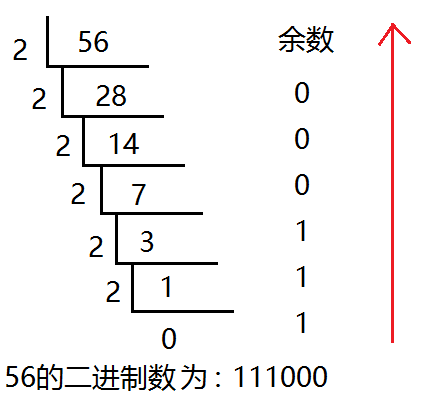
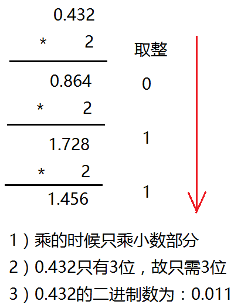
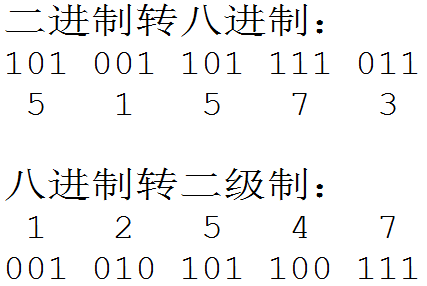
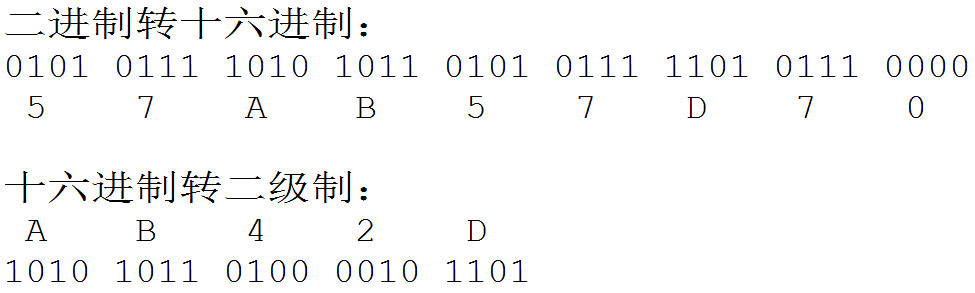

# 02-进制与位概念

## 一 进制概念

对于任何一种进制—X 进制，就表示某一位置上的数运算时是逢 X 进一位。我们最常用的进制是十进制。

### 1.1 二进制

**二进制**：只有 0 和 1 两种数据的组合形式，是计算机中的数据存储格式。

十进制转二进制方法：用十进制数除以 2，分别取余数和商数，商数为 0 的时候，将余数倒着数就是转化后的结果，如图：



十进制小数转二进制方法：小数部分和 2 相乘，取整数，不足 1 取 0，每次相乘都是小数部分，顺序看取整后的数就是转化后的结果，如图所示：



### 1.2 八进制

**八进制**：逢 8 进一，使用 0-7 这 8 个数字表示。

十进制转八进制：用十进制数除以 8，分别取余数和商数，商数为 0 的时候，将余数倒着数就是转化后的结果。

八进制转二进制：八进制的数和二进制数可以按位对应（八进制一位对应二进制三位）。



### 1.3 十六进制

**十六进制**（Hexadecimal）：由 0-9，A-F 组成，字母不区分大小写。与 10 进制的对应关系是：0-9 对应 0-9，A-F 对应 10-15。十六进制一位对应二进制四位。



十进制转化十六进制的方法：用十进制数除以 16，分别取余数和商数，商数为 0 的时候，将余数倒着数就是转化后的结果。

同理，十六进制转换为十进制方法示例：

0x1357 = $1*16^3 + 3*16^2 + 5*16^1 + 7*16^0$

## 二 C 语言中的进制

C 语言中进制的表示

- 十进制： 以正常数字 1-9 开头，如 123
- 八进制： 以数字 0 开头，如 0123
- 十六进制：以 0x 开头，如 0x123
- 二进制： C 语言不能直接书写二进制数

```c
 int a = 123;  //十进制方式赋值
 int b = 0123;  //八进制方式赋值， 以数字0开头
 int c = 0xABC; //十六进制方式赋值

 //如果在printf中输出一个十进制数那么用%d，八进制用%o，十六进制是%x
 printf("十进制：%d\n",a );
 printf("八进制：%o\n", b);
 printf("十六进制：%x\n", c);
```

贴士：在 C 语言中，整数默认的表示方法是十进制。

## 三 字节与位

### 3.1 字节与位的概念

字节与位是不同的概念：

- **位（bit）**：一个二进制代表一个位，一个位只能使用 0 或者 1 两种状态，常用表示单位为 bit，如 1b=1 位，1Kb=1024 位
- **字节（Byte）**：字节是计算机最小存储单位，一个字节是 8 个二进制，即 8 位，如 1B=1Byte=8 位，1KB=1024Byte

当前的计算机系统使用的基本上是二进制系统，数据在计算机中主要是以补码的形式存储的。

### 3.2 原码

现在我们知道字节才是计算机中真正的最小单元，有 8 位，那么一个正整数 1 ，负数 -1 在计算机中实际存储的形式为：

```txt
# 1
0000 0001

# -1，第一位是符号位，1表示负数
1000 0001
```

上述表示方式我们称之为 **原码**，即：最高位做为符号位，0 表示正,为 1 表示负，其它数值部分就是数值本身绝对值的二进制数。

### 3.3 反码与补码

原码存在一个问题：不利于计算，即当两个正数相减或不同符号数相加时，必须比较两个数哪个绝对值大。为了便于计算，还需要补码：

正数反码、补码都与原码相同：

```txt
# 正数示例：十进制中的 1 在原码中的表示
原码：0000 0001
反码：0000 0001
补码：0000 0001
```

负数的反码是：符号位不变，其他部分由原码取反（1 变 0,0 变 1），负数的补码是：符号位不变，其他部分由反码+1：

```txt
# 负数示例：十进制的 -15 在原码中的表示
原码：1000 1111
反码：1111 0000 #
补码：1111 0001 #
```

反码（complement）只是用于计算的中间过渡使用，**数据在计算机中真实的存在形式并不是原码，而是补码**。

现在使用反码来进行计算：$9 + (-6)$：

```txt
# 相加后最高位溢出舍弃，剩余8位为：0000 0011，结果为 3
9   0000 1001
-6  1111 1010
结果 0000 0011
```

在计算机系统中，数值一律用补码来存储，主要原因是：

- 统一了零的编码
- 将符号位和其它位统一处理
- 将减法运算转变为加法运算
- 两个用补码表示的数相加时，如果最高位(符号位)有进位，则进位被舍弃

对于 0 来说，理论上也应该有+0 和-0，那么其原码、反码都会两种表现形式。但是+0 和-0 的补码形式如下：

```txt
+0补码： 0000 0000
-0补码： 1000 0000  # 由于只用8位描述，最高位1丢弃，变为0000 0000
```
