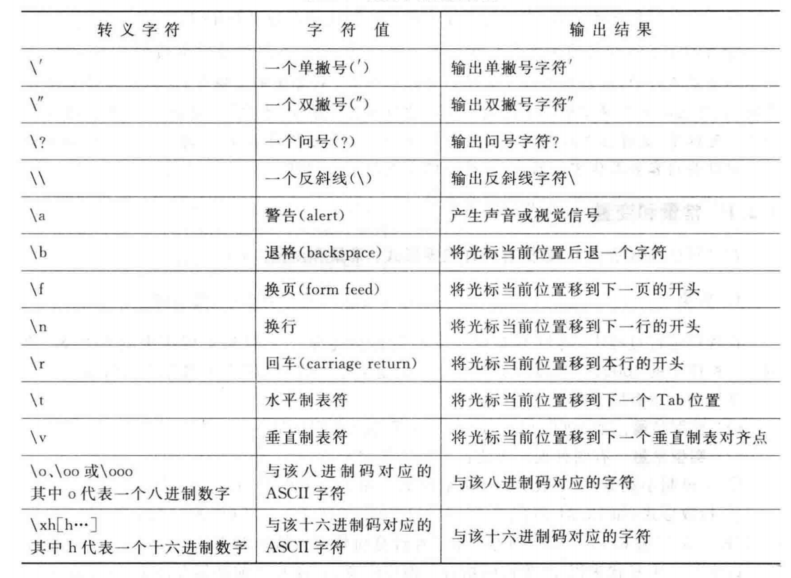

# 03.2-数据类型-变量

## 一 标识符与关键字

在计算机高级语言中，用来对变量、符号常量名、函数、数组、类型等命名的有效字符序列统称为标识符（identifier）。

在 C 语言中，标识符的命名遵循以下规范：

- 标识符不能是关键字
- 标识符只能由字母、数字、下划线组成
- 第一个字符必须为字母或下划线
- 标识符中字母区分大小写

关键字是 C 语言中已经作为特殊意义存在的单词，不能作为普通的标识符使用，C 语言共有 32 个关键字：

```txt
# 数据类型关键字 12个
char, short, int, long, float, double
unsigned, signed, struct, union, enum, void

# 控制语句关键字 12个
if, else, switch, case, defaul
for, do, while, break, continue, got, return

# 存储类关键字 5个
auto, extern, register, static, const

# 其他 3个
sizeof, typedef, volatile
```

在计算机中，数据需要存放在物理存储单元中，所以存储单元必须由有限的字节构成。使用不同范围的存储单元，能够有效的节省空间。

所谓类型，就是对数据分配存储单元的安排，包括存储单元的长度（多少个字节）以及数据的存储形式，不同的类型分配不同的长度和存储形式。

C 语言数据类型（C99）：


基本类型和枚举类型都是数值，统称为算术类型（arithmetic type），算术类型和指针类型为纯量类型（scalar type），因为其变量的值是以数字来标识。

数组类型和结构体类型统称为组合类型（aggregate type），共用体类型不属于组合类型，因为在同一时间内只有一个成员具有值。

表格：

| 数据类型      | 32 位上数据长度 | 64 位上数据长度 |
| ------------- | --------------- | --------------- |
| char          | 1 字节          | 1 字节          |
| short int     | 2 字节          | 2 字节          |
| int           | 4 字节          | 4 字节          |
| unsigned int  | 4 字节          | 4 字节          |
| float         | 4 字节          | 4 字节          |
| double        | 8 字节          | 8 字节          |
| long          | 4 字节          | 8 字节          |
| unsigned long | 4 字节          | 8 字节          |
| char\*        | 4 字节          | 8 字节          |

贴士：所有类型的指针长度相同

## 二 整型

### 2.1 整型变量分类

整型变量（定点型）分类：

```txt
short： 短整型，占据2字节，在IA32系统中占据16位二进制位
int：   整型，占据4字节，在IA32系统中占据32位二进制位
long：  长整型，Windows为4字节，32位Linux为4字节，64位Linux为8字节
long long：长长整型，占据8字节
```

C 语言标准中没有明确规定整型数据的长度，但 long 类型整数的长度不能短于 int 类型， short 类型整数的长度不能长于 int 类型。当一个小的数据类型赋值给一个大的数据类型，不会出错，因为编译器会自动转化。但当一个大的类型赋值给一个小的数据类型，那么就可能丢失高位。

### 2.2 符号

此外上述分类根据是否可以表示负数可以再划分为符号数（signed）、无符号数（unsigned）两种，如果不加符号，即定义数据类型时没有添加 `signed`，则默认为有符号数。对于无符号数来说，全部的数据长度都用来表示值了，无法表示负数，只能表示正数和 0，而有符号的整型数据，其最高二进制位表示符号，即 0 表示正号，1 表示负号。

如果某个整型数据的长度是 n 个二进制位，则：

- 无符号类型的表示范围是：$0$ ~ $2^n-1$
- 有符号类型的表示范围是：$-2^{n-1}$ ~ $2^{n-1}- 1$

`sizeof()` 函数可以输出数据所占据的字节数，示例：

```c++
#include <stdio.h>

int main(){
  short a = 10;
  int b = 10;
  long c = 10l; //或者10L
  long long d = 10ll; //或者10LL

  printf("sizeof(a) = %u\n", sizeof(a));
  printf("sizeof(b) = %u\n", sizeof(b));
  printf("sizeof(c) = %u\n", sizeof(c));
  printf("sizeof(c) = %u\n", sizeof(d));

  printf("short a = %hd\n", a);
  printf("int b = %d\n", b);
  printf("long c = %ld\n", c);
  printf("long long d = %lld\n", d);

  // unsigned 表示无符号， u，ul等后缀大小写通用
  unsigned short a2 = 20u;
  unsigned int b2 = 20u;
  unsigned long c2= 20ul;
  unsigned long long d2 = 20ull;

  printf("unsigned short a = %hu\n", a2);
  printf("unsigned int b = %u\n", b2);
  printf("unsigned long c = %lu\n", c2);
  printf("unsigned long long d = %llu\n", d2);

  return 0;
}
```

### 2.3 整型变量的打印

整型变量的进制输出：

```txt
%d 输出一个有符号的10进制int类型
%o 输出8进制的int类型
%x 输出16进制的int类型，字母以小写输出
%X 输出16进制的int类型，字母以大写输出
%u 输出一个10进制的无符号数
```

整型变量的整型输出：

```txt
打印格式 含义
%hd 输出short类型
%d 输出int类型
%ld 输出long类型
%lld 输出long long类型
%hu 输出unsigned short类型
%u 输出unsigned int类型
%lu 输出unsigned long类型
%llu 输出unsigned long long类型
```

## 三 字符型

### 3.1 字符型 char

由于字符是按其代码（整数）形式存储，因此 C99 将字符型数据 char 也作为整数类型的一种，但是字符型变量只占据 1 个字节，使用 `''`单引号表示。

**char 的本质就是一个 1 字节大小的整型。**，目前大多数系统采用 ASCII 字符集，包含了 127 个字符，其存储形式如下案例：

```txt
大写字母'A'是十进制数65，二进制形式为1000001
小写字母'a'是十进制数97，二进制形式为1100001
```

由上看出，127 个字符都可以使用 7 个二进制位表示，所以 C 语言中字符只占 1 个字节（8 位），字节的第 1 位为 0。字符可以以十进制整数形式输出，也可以使用字符形式输出：

```c++
    char c = 'A';
    printf("%c\n", c);      // A
    printf("%d\n", c);      // 65
```

### 3.2 字符型的符号

字符型也可以添加符号前缀：

- signed char：有符号字符型，占据字节数 1，取值范围是-128~127（$2^7$）
- unsigned char：无符号字符型，占据字节数 1，取值范围 0~255（$2^8$）

如果将一个负整数赋值给有符号字符型变量是合法的，但是此时它不代表一个字符，而是作为一个字节整型变量存储负整数，如：

```c++
signed char c = -6;
```

注意：如果在定义变量时既不加 signed，也不加 unsigned，C 标准未规定是否按照`signed char`处理，由各个编译器自己决定。

### 3.3 转义字符

常见转转义字符：



## 四 浮点型

浮点数据用来表示带小数点的实数。在 C 语言中，实数是以指数形式存放在存储单元中的，此时实数可以有很多种表现形式，比如 3.14 可以书写为 $3.14\times10^0$、$0.314\times10^1$，小数点的位置在数值中左右浮动，所以实数的指数形式称为浮点数。

当小数点的前数为 0，后第 1 位不为 0 的表示形式为规范化指数形式，如 $0.314\times10^1$。

浮点数与计算机平台无关，其分类：

- float：单精度浮点型，占据 4 个字节，占据 32 位二进制位。定义方式：`float a = 3.14f;`，f 大小写通用。可表示范围是：$-3.4 *10^3$$^8$ ~ $3.4* 10^3$$^8$ $-3.4 \times 10^{38}$~$3.4 \times 10^{38}$
- double：双精度浮点型。占据 8 个字节，占据 64 位二进制位。定义方式：`double b = 3.14;`。可表示范围是：$-1.7 \times 10^{308}$~$1.7 \times 10^{308}$

在 C 语言中进行浮点数运算时，float 数据都会自动转换为 double 型，然后进行运算。

不同编译器对该类型处理不同，VC++6.0 对`long double`和`double`一样处理，分配 8 个字节。

示例：

```c
#include <stdio.h>

int main(){
  //传统方式赋值
  float a = 3.14f; //或3.14F
  double b = 3.14;

  printf("a = %f\n", a);
  printf("b = %lf\n", b);

  //科学法赋值
  a = 3.2e3f; //3.2*1000 = 3200，e可以写E
  printf("a1 = %f\n", a);

  a = 100e-3f; //100*0.001 = 0.1
  printf("a2 = %f\n", a);

  a = 3.1415926f;
  printf("a3 = %f\n", a); //结果为3.141593

  return 0;
}
```

## 五 类型限定符

类型限定符：

```txt
extern    声明一个变量，但是没有建立存储空间
const     定义一个常量，常量的值不能修改
volatile  防止编译器优化代码
register  定义寄存器变量，提高效率。
```

register 是建议型的指令，而不是命令型的指令，如果 CPU 有空闲寄存器，那么 register 就生效，如果没有空闲寄存器，那么 register 无效。

一般的情况下，把建立存储空间的声明称之为“定义”，而把不需要建立存储空间的声明称之为“声明”。

## 六 数值溢出

当超过一个数据类型能够存放最大的范围时，数值会溢出。

有符号位最高位溢出的区别：符号位溢出会导致数的正负发生改变，但最高位的溢出会导致最高位丢失。

比如数据类型 char，只占用 1 个字节，即 8 位，只能表示 -128 - 127。

```c++
#include <stdio.h>

int main(){
  char ch;

  //符号位溢出会导致数的正负发生改变
  ch = 0x7f + 2;      //127+2
  printf("%d\n", ch);

  return 0;
}
```

所以在赋值时需要注意数据类型的宽度，以免差生数据错误、精度丢失的问题，在 C 语言中，通常采用下列顺序进行赋值：

```txt
double > float > int > short > char
```
